# logbook

## TODO

- adc_5g
  - Implement OGP and INL calibrtion
    - Starting with https://github.com/nrao/adc5g_devel
    - O and G are good.
    - P not so much

- In 8Ghzspectro.pdf, NOEMA:
  - uses a noise diode to calibrate ADC
    - Try that
  - Implements an overlapped PFB to get a flat RF band response

- [ ] Start differentiating select in 3 versions

- Black boxes
  - [ ] nrt_bw1800_ch16_fft_core (Issue with reset values for delay counters)
  - [ ] nrt_bw1800_2pols_ch16_8taps_pfb_core (Issue when generating IP)


- reorder firmware design files in project
- Adapt scripts to these new locations

TODO:
  - Add FPGA_ver verification in scripts
  - Add unbiased round in fft (and pfb?) to remove DC lines
  - TGbE_dst_addr from pulsar_mode_v0 can hold 8 destination ports, but needs to cycle through all of them.  Implement a mecanism to reset counter when last configured one is reached (when port=0 ? or 0xFF ?).
  - mydesign.SEFRAM.arm() should wait for armed PPS to start


## 2024/06/24 ... 2024/07/12
- Lost logbook...

## 2024/06/23
- ADC_receiver_V2
  - Add SLICE to rcvr*_decfir*col*_grp for tree_adder


## 2024/06/19
- ADC_receiver_V2
  - Replace some SRL16 delays by reg-based delay lines
  - NET KEEP doesn't seem to work for all fan-out reg-based tree.
  - decfir0 and decfir1
    - Split AREA_GROUP in 3 rectangles of 32 DSP for each 3 cols.
  - Start fit
  - UCF typos...
  - Start fit
  

## 2024/06/18
- ADC_receiver_V2
  - W3OH observation processing of data gathered on the 2024/04/13
    - DD and GG look close to what is generated by the current autocorrelator
      - 
      - 
      - 


## 2024/06/15
- ADC_receiver_V2
  - Remove burster*/chan0/status reg
  - Add reg on output of arb_gen*  (could be removed/commented out now that design is tested?)
  - Merge TenGbE* status bits into same register field


## 2024/06/11
- ADC_receiver_V2
  - W3OH observation processing of data gathered on the 2024/04/13
    - Strong similarities with EE* / WW* from Historical autocorrelator:
      - 
      - 
      - 
    - Some difference with EW / EW* and DD* / GG*


## 2024/05/31
- ADC_receiver_V2
  - Timing violations:
    - terrible...  INST "*_TenGbE0_ten_Gbe_v2/*" in AREA_GROUP are clearly not a good idea.
    - PlanAhead
  - Physically reverse channels in fabric to align them with 10G IPs.
  - Move top pipeline regs into bursters to ease placement constraint.
  - Network loss


## 2024/05/31
- ADC_receiver_V2
  - In the .pou files of the NRT, Vdop qui contient des valeurs entre 8.29 et 8.44 (km/s)
  - 8.3 km/s / c * 1665 MHz = 46 kHz. 
  - This explains the frequency difference observed between NRT current tools and renard:/home/cedric.viou/BHR_NRT/reformat_galactic_pcap_and_process.py
  - Make frequency plot correction


## 2024/05/29
- DHCP server not started after reboot.
  - Start with : sudo /etc/init.d/dnsmasq restart
  - Restart after each reboot: sudo systemctl enable dnsmasq


## 2024/05/28
- ADC_receiver_V2
  - Timing violations:
    - 2111701 paths analyzed, 469309 endpoints analyzed, 425 failing endpoints
    - -1.390ns, -0.990ns, ...
  - Missing xaui_phy_5 and 7 AREA_GROUP
  - Add */TenGbE*/runt_gen_*, */TenGbE*/pipeline* and */TenGbE*/led_out_drv* AREA_GROUP
  - Start fit
  - Timing violations:
    - adc0_clk  
      - 2111701 paths analyzed, 469309 endpoints analyzed, 284 failing endpoints
      - -0.952ns, ...
    - epb_clk
      - 1046789 paths analyzed, 39116 endpoints analyzed, 355 failing endpoints
      - -7.3 ns
    - xaui_clk
      - 266062 paths analyzed, 34670 endpoints analyzed, 22 failing endpoints
      - -1.219ns
  - Add INST "*_TenGbE0_ten_Gbe_v2/*"          AREA_GROUP = "receiver0_grp";  for all 4 receivers.


## 2024/05/27
- ADC_receiver_V2
  - Comment out histogram because fanout buffers get merged and break time violation
  - Add longer delay lines for led_out drivers
  - Start fit
  

## 2024/05/22
- ADC_receiver_V2
  - New neg slacks in fanout butters.
  - Try -register_duplication; option in /FAN/HDD2/CASPER/mlib_devel_GIT/xps_base/XPS_ROACH2_base/etc/fast_runtime.opt
  - Start fit.


## 2024/05/22
- ADC_receiver_V2
  - Add reg in tengbe*/led_out_drv/pulse_extender/pos_detect to help timings.
  - Don't look at others neg slacks for now...
  - Start fit.


## 2024/05/21
- ADC_receiver_V2
  - Add AREA_GROUP receiver2_decfir_sum_grp for */rcvr*/dec_fir*/convert*, real_sum and imag_sum
  - Test in burster_sim a new scheme to restart samples_in counter.
    - Sim ok.  Start fit.


## 2024/05/17
- ADC_receiver_V2
  - Fitting 4 channels together rather than 2 generates about the same slacks.
  - Issue in burster/samples_in.  rst input of counter is fed by or logic


## 2024/05/16-17
- ADC_receiver_V2
  - Still getting neg slacks.
  - Try to fit all 4 channels to see if this get similar on all 4 before trying to fully fix one


## 2024/05/14
- ADC_receiver_V2
  - On rcvr0 only!
    - Replace Round 39_30 bits to 16_15 bits by truncate to 18_17 bits and round (unbiased: ±Inf) to 16 bits
  - Keep rcvr2 unmodified for comparison
  - 


## 2024/05/13
- ADC_receiver_V2
  - Replace dec_fir convert Round (unbiased: ±Inf) by Round (unbiased: even values)
    - Fix_39_30 in, Fix_16_15 out
    - Same timing violation
  - Same RAM blocks violations


## 2024/05/06
- ADC_receiver_V2
  - PipeADC[01] z^-4 in rcvr units get partially merged too with delay line delays
  - Reduce pipeADC to z^-1
  - Fit is now ok on that section
  - But still failing in dec_fir convert and in RAM blocks
  

## 2024/05/05
- ADC_receiver_V2
  - Fanout tree for ADC0 and ADC1 always get optimised to a single delay line with last reg feeding all recvr unints -> placement cant be successful.
  - Replace fanout tree by delay line with taps for each rcvr units.


## 2024/04/19
- ADC_receiver_V2
  - Synthesys colapses fan-out registers inserted to ease timing.  But timing fails...  Find option to preserve them.
  - In adc_receiver_v2/XPS_ROACH2_base/implementation/xflow.opt, activate these options
    -register_duplication on;
    -equivalent_register_removal off;


## 2024/04/17
- ADC_receiver_V2
  - Clear coherence measured between pols on W3OH
  - 


## 2024/04/15
- ADC_receiver_V2
  - Process and plot data gathered on the 2024/04/13
    
  - 1665.6 MHz and 1667.56 MHz lines are clearly visible


## 2024/04/15
- ADC_receiver_V2
  - Replicate AREA_GROUP constraints for rcvr2
  - Start fit
  

## 2024/04/13
- ADC_receiver_V2
  - No more neg slacks in rcvr0


## 2024/04/12
- ADC_receiver_V2
  - Schedule W3OH data recording on Saturday 2024/04/13 02:05-03:00 TS
    - nenufarobs@renard:/data/renard/BHR$ echo "sudo tcpdump -i p2p1 -n  src host 192.168.5.20 -C 1000 -w W3OH.pcap" | at 12:30 tomorrow


## 2024/04/10
- ADC_receiver_V2
  - -3ns slacks between rcvr?/pipeadc1 and rcvr?/pipeadc?
  

## 2024/04/08
- ADC_receiver_V2
  - Composite spectrum of BF feed generated by stiching ~100Mhz bands of receiver (~50kHz resolution)
    - 
  - Composite spectrum of HF feed generated by stiching ~100Mhz bands of receiver (~50kHz resolution)
    - 


## 2024/04/06
- ADC_receiver_V2
  - Still getting some neg slacks in channels...
  - Signal processing looks good.
  - 
  - HF feed tests
    - At 1840 MHz, saturation before HBs, probably at dec_fir cast to Q16.15


## 2024/04/02-04
- ADC_receiver_V2
  - Still getting some neg slacks in channels...
  - Generate a bitstream anyway to test firmaware and write some python config code
  - 112 and 28 MHz streams look functionnaly good
    - But strange quantization present in Re/Im histogram -> put back some snap to pinpoint the origine of such structures
    - 
  - Recale units are wrong:
    - 
    - c2ReIm is wrong.  The way slicing is performed inside could explain why Re and Im behave differently.
    - Fixed
  - Start fit


## 2024/03/25
- ADC_receiver_V2
  - Still getting some neg slacks in channels...


## 2024/03/18
- ADC_receiver_V2
  - Same neg slacks in convert...
  - PlanAhead
  - Split rcvr0 area_gourp into 4 groups (L0, dec_fir, HBs, rescale)
  - Start fit 
- ROACH
  - Add 10G link between ROACH and RENARD on old fiber link:
    - MN03 03 04: SFP 10G ROACH_sfp0 to Renard p2p1 (cage further away from power supply)
    - MN03 05 06: SFP 10G ROACH_sfp1 to Renard p2p2 (cage closest to power supply)
    - MN03 08 (or 07?): SFP 1G Bidi from ROACH to Renard SEFRAM
  - Configure new interface on renard:
    - Update nenufarobs@renard:/etc/netplan/01-netcfg.yaml
    - With p2p2, addresses: 192.168.5.181/24, mtu 9000
    - sudo netplan appy
  - On new link, fibers 1, 6 and 12 are broken.  The others 21 fibres are ok.


## 2024/03/17
- ADC_receiver_V2
  - New neg slacks
  - Increase pipeline to z^-3 in bit_select converts
  - Add fanout buffer in convert
  - Start fit


## 2024/03/16
- ADC_receiver_V2
  - New neg slacks
  - Add fanout buffer on PPS
  - Start fit
  - neg slacks in bit_select
  - PlanAhead
  - Increase pipeline to z^-2 in bit_select converts
  - Start fit


## 2024/03/15
- ADC_receiver_V2
  - neg slacks in TenGbE* and in bitselect
  - Add some pipeline in TenGbE* and in bitselect to ease fit
  - Start fit


## 2024/03/14
- ADC_receiver_V2
  - Comment out debug snaps
  - Add area constraints for each channels.
  - Clone 4 channels
  - Start fit


## 2024/03/06
- ADC_receiver_V1
  - adc_receiver_v1_2024_Mar_05_2231.fpg
    - Fix convergent roundings in rcvr0/rescale_unit?/bitselect_??
- ADC_receiver_V2
  - Clone 2 channels
  - Replace "automatic" streamer config by simple registers
  - Fit issue (-1.5ns)
  - Duplicate loc constraints
  - Fit issue (-0.3ns), but testable
  

## 2024/02/22
- ADC_receiver_V1
  - renard
    - Create script of display UDP packet in realtime
    - bitselect values are upside down -> fixed
    - HI in 28 and 112 MHz BHR receiver mode
    


## 2024/02/21
- ADC_receiver_V1
  - rcvr/HBs
    - Add mechanism to raise DV only when sync is pulsed.
    - Start fit
    - Successful
  - TenGbE0_spead_out_ss not stuck anymore
  - Packets flowing to renard
  - Values are saturated
  - Increase bitselect selection range
  - Start fit
  - bitselect behavior is strange...


## 2024/02/20
- ADC_receiver_V1
  - Framer not starting
  - snap do not cover enough internal signals to understand issue.
  - Add more signals
  - Burster may not be started correctly
  - Comment SEFRAM in design and ucf
  - Start fit (done in 01:05 hours)
  - burster_status_snap_ss looks ok
  - TenGbE0_stream_in_bus_ss looks ok
  - TenGbE0_spead_out_ss looks stuck
  - ('TenGbE0_tx_afull', 1) and ('TenGbE0_tx_overflow', 1)
  - Fiber was not connected -> fixed that
  - Now TenGbE0_tx_cnt increase very quickly (malformed frames?)
  - Test adc_c9r_sst_v5.py -> still ok


## 2024/02/20
- ADC_receiver_V1
  - Comment out SEFRAM_snap
  - SEFRAM starts computing as soon as mydesign.SEFRAM.arm() is called.
    - That's probably not how we what this.  
    - mydesign.SEFRAM.enable() seems to be a workaround (comment says "after dummy frame, allow outputing data and starting framer")
  - burster seems to be stuck.
    - Add snap for buster control signals
    - Add snap for TenGbE input and TenGbE spead output
  - Start fit
  - Timing violation (-0.5 ns in dec_fir0)
    - Probably ok for test.


## 2024/02/19
- ADC_receiver_V1
  - HB filter gains better now (slightly > 0 dB)
  - 10G streamer seems stuck
    - Add snap to watch spead packetizer output
    - Start fit
    - But the network+spead conf may just be wrong
  - Fit failed (in histogram, <0.3ns slack)
  - Add network conf in receiver class


## 2024/02/16
- burster_sim.slx
  - Adapt select_4f64 to get decimated stream
- ADC_receiver_V1
  - Integrate burster
  - Start Fit
  - Timing violation (-0.6 ns) in histogram


## 2024/02/15
- Valon
  - Replacing Valon with SMC100A synthesizer (5dBm power output) greatly improves the feed spectrae
    - 
    - 
    - 


## 2024/02/13
- Valon
  - ADC input clock is probably too low, leading to this image around Fe/4
  - Scan of Valon ouput level in (5, 2, -1, -4)
  - 
  - Image is 6dB lower at 5dBm input clock (5dBm on Valon, but signal is split and then balun on adc5g board may reduce that further...)
  - Measure the clock input swing on adc5g boards.  It should be 447 mVpp ideally.


## 2024/02/12
- ADC_receiver_V1
  - adc_receiver_v1_2024_Feb_05_1210.fpg
  - Local HI visible at all filter stages
  - 
  - But loosing 9dB after each stages.
  - No DC lines visible, except on the other polarisation, where the signal input level is very low.
  - Change Coefficient Q(20, 17) to Q(20, 19).  Why that???
  -  Start fit


## 2024/02/08-09
- ADC_calibrator.py + ADC.py
  - Add functions for ADC calibration (manual and automatic)
  

## 2024/02/07
- RFSoc
  - Integration done
- adc5g
  - Create Gui for ADC calibration
    - 
    - Found that ADC cores are labeled as (1, 3, 2, 4).
  

## 2024/02/04
- ADC_receiver_V1
  - adc_receiver_v1_2024_Feb_03_1855
    - Local HI visible on HBs_dec_out and HBs_HB0_out (for decimation = 2)
    - But not wfor decimation = 8 (when HBs_HB2_out and HBs_HB1_out are used...)
    - Replace HB2 and HB1 's coefficients by HB0's
    - Start fit
  - Test histogram on HBs
    - ArmedSync connected in place of PPS -> can only see one value -> Propagate PPS from top to hist entity
    - Abort fit
    - Start fit
    - Timing violation (-0.3 ns)
    - Generate bitstream anyway (see logbook on the 2024/01/30)
    - ...
- RFSoc
  - Integration almost done (chassis, power, fans, still missing some RF adaptors)


## 2024/02/04
- ADC_receiver_V1
  - Timing violation: adc_receiver_v1_2024_Feb_03_2328


## 2024/02/03
- ADC_receiver_V1
  - Fit too long.  Abort after ~20h
  - Remove hist from HBs
  - Start fit (much faster.  Bug on previous time or real issue with hist?)
  - Fit ok: adc_receiver_v1_2024_Feb_03_1855
  - Add a single hist to HBs and a 4-1 mux in front of it to select which bus to spy on.
  - Start fit


## 2024/02/02
- ADC_receiver_V1
  - Fit failed (receiver0 still present in ucf file)
  - Start fit
- Calibration ADC
  - Strange behavor on offsets
    - ADC0 ch2 and ADC1 ch3 (or 2?) don't seem to change


## 2024/02/01
- ADC_receiver_V1
  - Local HI visible on dec_out
  - Local HI visible on decim_4x_HB2_out
    - 
  - Local HI visible on decim_4x_HB1_out (HB2+HB1)
    - 
  - Local HI visible on decim_4x_HB0_out (HB2+HB1+HB0) -> decimation = 8 
    - 
    - But presence of a DC line
  - Local HI visible on decim_4x_HB0_out (HB0 only) -> decimation = 2
    - 
    - No DC line
  - With ADC noise dynamic close to maximum on receiver0 inputs, the noise dynamic is 15% on the output of dec_fir, 5% at the output of H0 only and 0.6% at the output of HB2+1+0.  The H0 filter might behave badly with low-level input signal and create this DC line.
    - Replace -5 shift on dec_fir by -3 (gain of 4)
    - Put back original HB2 and HB1 filter coefficients since they are not the identified cause of DC line, so that we can look at the actual gain of the chain.  And add gain in HB filters if needed.
    - Start fit
      - Error name too long: adc_receiver_v1_receiver0_decim_4x_hist_HB0_c0_im_b0_user_data_in
      - Rename entities:
        -  adc_receiver_v1/receiver0/decim_4x/hist/HB0/c0/im/b0  ->  adc_receiver_v1/rcvr0/HBs/hist/HB0/c0/im/b0


## 2024/01/31
- ADC_receiver_V0_1
  - Test histogram.  Create class to be used in designs (histogram.py)
  - Integrate histogram into ADC_receiver_V1


## 2024/01/30
- ADC_receiver_V1
  - Fit: Timing violation
  - Resume `gmake -f system.make bit` to generate `adc_receiver_v1/bit_files/*`
    ```bash
    $ cd ..../adc_receiver_v1/XPS_ROACH2_base
    $ export XILINX_PATH=/FAN/HDD2/xilinx/14.7/ISE_DS
    $ source $XILINX_PATH/settings64.sh
    $ cp -f etc/bitgen.ut implementation/bitgen.ut
    $ cd implementation ; bitgen -w -f bitgen.ut system ; cd .. ; bash gen_prog_files
    ```
  - Bit file generated -> to be tested
  - Remove DSP48 used as adders in snapshot blocs to save them
  - Start fit
  - L0 mixer could be optimized (16x4 DSP48 -> 16x2 DPS48) by merging 2 samples into one DSP input
    - Check that with L0_mixer_optim.slx


## 2024/01/29
- ADC_receiver_V0
  - For LF feed, H1 line (and RFI) can be identified and correctly located with receivers configured at different L0
    - 115-MHz wide band
      - 
      - 
  - But not for 28-MHz wide band...
    - No HI line
    - DC line -> no convergeant rounding?
    - Replace HB filters instances 2 and 1 by HB0 instances
    - Add snap between HB filters
    - Rework arb_gen and ADC_data mux to feed that to snap (and test that arb_gen is working correctly)


## 2024/01/22
- ADC_receiver_V0
  - Testing firmware
    - 2x decimation (112MHz-BW) looks good (1 dv / 2 clock_cycles)
    - 2x+4x decimation (28MHz-BW) looks good (1 dv / 8 clock_cycles)
    - For HF feed (1.6-3.2 GHz), the receiver.Fc property doesn't compute L0 tables properly.  Need to add Ny-window information.
  

## 2024/01/19
- ADC_receiver_V0
  - Reduce dec_fir filter length to 96 coefficients, still providing 50dB rejection in bandpass.
  - Fit successful


## 2024/01/19
- ADC_receiver_V0
  - Comment debuging snapshots to free up ressources
  - Integrate histogram on adc[01]


## 2024/01/16-18
- ADC_receiver_V0
  - Timing issues
    - Edit /FAN/HDD2/cedric/NRT_spectro/adc_receiver_v0/XPS_ROACH2_base/casper_create_ppr.tcl (set proj_name adc_receiver_v0)
    - cedric@nanunib:/FAN/HDD2/cedric/NRT_spectro/adc_receiver_v0/XPS_ROACH2_base$ ./casper_create_ppr.sh
    - cd ../planahead
    - planAhead
  

## 2024/01/12
- ADC_receiver_V0
  - Add receiver1 to test multi-chan mode


## 2024/01/08-09
- ADC_receiver_V0
  - Fixing param/generic transferts between simulink, Matlab and HDL
  - Fit Done! 


## 2024/01/04-07
- ADC_receiver_V0
  - Instanciate HB_decimator in receiver
  - Getting XSG generation failed
    - Errors in HB_decimator_config.m first
    - Then instanciations have generic map (...,  g_coef_list => "B0_coef", g_nof_coef => 0, ...)  -> simulink params not nicely forwarded to HDL.
    - /FAN/HDD2/cedric/NRT_spectro/adc_receiver_v0/sysgen/synth_model/adc_receiver_v0.results
      ```
      Elaborating entity <HB_decimator> (architecture <behavioral>) with generics from library <work>.
      ERROR:HDLCompiler:1242 - "/FAN/HDD2/cedric/NRT_spectro/adc_receiver_v0/sysgen/synth_model/adc_receiver_v0.vhd" Line 11937: "g_nof_coef is NOT of the form 3 + (2+2) * M, with M in natural numbers": 
      Execution of entity hb_decimator failed
      Netlist hb0_filter_entity_63b0845425(structural) remains a blackbox, due to errors in its contents
      ```


## 2024/01/01
- half_band_filter_sim.slx
  - We now have a parametrizable blackbox for HB_decimator.vhd


## 2023/12/04
- adc_sst_v7.py
  - Wrong accumulation computation because Nfft is wrong now.
  - Keeping 5 spec/s


## 2023/11/17
- Survey CEM
  - Fix adc_sst_v7.py
  - Start adc_sst_v7 on HF Feed at Fri Nov 17 2023 10:17:35 GMT+0000
  - Quick plots look ok.
  - Process and recording to be deployed by Ismaël


## 2023/11/15
- Survey CEM
  - Retreive adc_sst_v7 for 4G mini-cell measurements
  - Correct some register name in python that changed in SEFRAM.py


## 2023/11/13-15
- ADC_receiver_V0
  - NRT_2G_spectrometer/firmware/receiver/DDC_par16/dec16_fir_and_H3_H2_H1_H0.ipynb
    - Work on the final HB filters


## 2023/11/09
- ADC_receiver_V0
  - with of the filtrer is too narrow by a factor of 2
    - 
    - Wrong use of scipy.signal.firwin (mixup between f_s and f_ny)
    - Fixed it
    - Realise that we can loosen the filter length (256 -> 128) to get the right rejection
    - Set new coef to slx file
  - Start fit
  - Filter looks good now
    - Can see HI, and radars
    - 


## 2023/11/06
- ADC_receiver_V0
  - Output of dec_fir look good now regarding NCO
    - Can see HI, and radars
  - However, the with of the filtrer is too narrow by a factor of 2 -> need to understand and fix that.
  - Change back dataformat to original configuration now that it is understood.
  - Use Q16.15 coefficients for receiver0
  - Start fit
  - Data still look good, but wrong dec_out snap data width.  Fix, increase depth and fit again  


## 2023/11/02
- ADC_receiver_V0
  - receiver0_L0_?_mem memories were written with wrong endian.
  - Fix python
  - Put back dec_fir1 filter and dec_out snap
  - Start fit


## 2023/10/31
- ADC_receiver_V0
  - Add snap to all mixer outputs to try to understand something...


## 2023/10/08
- ADC_receiver_V0
  - Forgot to modify data format for dec_fir1
  - Used Fix_32_23 instead of Fix_32_22
  - Start fit


## 2023/10/06
- dec_fir_sim
  - Simulation looks good...
- ADC_receiver_V0
  - dec_fir snapshot read back as 32-bit data.  But it's 64bits...
  - Data saturation located on dec_fir output could be due to cast from Fix_40_30 to Fix_16_15 in dec_fir, after >>5.
    - Cast to Fix_32_23 and record data to check.
    - Start fit


## 2023/09/27
- ADC_receiver_V0
  - Inject a sine at 5 MHz, if supported
    - 50MHz, 10 mV is set
  

## 2023/09/26
- ADC_receiver_V0
  - snapshots data for kc=0
    - L0_0_din0_in: \mu=6e-3, \sigma=0.14
    - L0_0_mult_out: \mu=-5e-5, \sigma=6e-4
    - L0_0_cast_out: \mu=-5e-5, \sigma=6e-4
    - dec_fir0_sum_out: \mu=5e-4, \sigma=7e-4, lots of 0's, strongly positive (almost like a power...)
    - dec_fir0_sr5_out: \mu=1e-5, \sigma=4e-5, lots of 0's, strongly positive (almost like a power...)
  - snapshots data for kc=0
    - L0_0_din0_in: \mu=6e-3, \sigma=0.14
    - L0_0_mult_out: \mu=1e-3, \sigma=9e-2
    - L0_0_cast_out: \mu=1e-3, \sigma=9e-2
    - dec_fir0_sum_out: \mu=1e-3, \sigma=3e-1, 0's half the time
    - dec_fir0_sr5_out: \mu=2e-4, \sigma=1e-2, 0's half the time


## 2023/09/25
- ADC_receiver_V0
  - L0: With right endian (dt.newbyteorder('>')), data looks fine after mixer
  - The 256 coef of the dec_fir add up to 32.  We may be saturating the output of the dec_fir
  - Add 5 shift right and snaps to dec_fir0 to check that 
  - New fit


## 2023/09/22
- ADC_receiver_V0
  - NCO to dec_fir : wrong Complex to ReIm configuration (getting Fix_8_7 instead of Fix_16_15)
  - Fix
  - New fit

## 2023/09/21
- ADC_receiver_V0
  - Recompile without receiver, only SEFRAM.  No register read error anymore...
  - Put back receiver and compile to check again.
  - No register read error anymore...  Quite strange and scary, but let's move on!


## 2023/09/20
- ADC_receiver_V0
  - simulating NCO L0 (NCO_sim.xls)
  - Fix mem output to UFix_32_0


## 2023/09/19
- ADC_receiver_V0
  - But no errors during reads on older designs (pulsar mode in occurence)
  - NCO output looks bad (too strong -> sim is needed)


## 2023/09/18
- ADC_receiver_V0
  - XPS not started at right level..  Start again...
  - Same errors when reading back the data.  Getting some 0's instead...
    - Wireshark shows 0's : !read ok \0\0\0\0 even for a single register


## 2023/09/18

- ADC_receiver_V0
  - Testing L0 tables programming
  - Errors when reading back the data.  Getting some 0's instead...
  - Cleanup working directory
  - Start new fit


## 2023/09/13-14

- ADC_receiver_V0
  - Fit failures because of wrong ucf content
  - Remove SEFRAM to speedup timing closure corrections
  - Add pipeline registers between Li and dec_fir[01], and dec_fir[01] and dec_out
  - Reduce dec_fir coef_w (25 -> 16)
  - Change TreeAdder DSP48 implementation into behavioral
  - Fit sucessful 2023_Sep_14_1449
  - Add back SEFRAM
  - Fit sucessful 2023_Sep_14_1547 ???


## 2023/09/12

- ADC_receiver_V0
  - Fit failed but that was expected.
  - Separate the 2 dec_fir in different AREA_GROUP


## 2023/09/11

- ADC_receiver_V0
  - Fit failed  (-0.66 to -0.3 ns slack in receiver fir_dev_tree_adders)
  - PlanAhead
  - Reduce AREA_GROUP surface for L0 + dec_fir16


## 2023/09/10

- ADC_receiver_V0
  - Fit failed  (-0.7 to -0.3 ns slack in receiver fir_dev_tree_adders)
  - PlanAhead
  - Wrong name for receiver module -> constraint not taken into account
  - Fix and rerun


## 2023/09/09

- ADC_receiver_V0
  - Fit failed (no area constraint)
    - Add AREA_GROUPs to locate it in the top half of the FPGA


## 2023/09/08

- ADC_receiver_V0
  - Synthesize NCO+DDC16 with snap for test
  - Write python model to configure NCO tables


## 2023/09/05

- Simulation look good in August
- Instanciate HB filter in a single channel simulink simulation model
  - Looks OK.  Would need formal comparison with QuestaSim simulations
- Start instanciating a 2-chan complex filter for the ADC_receiver_V0 design


## 2023/07/28

- Working on vhdl HB filter

## 2023/07/04

- roach2_tut_tge
  - Succesfully configure gbe0 and gbe1 to stream data to each other.
  - Succesfully configure gbe0 and gbe1 to stream data to themselves (loopback).

- RFSoC4x2
  - 100G network still not working
  - Strange messages at compile
    - Does the provided bitstream works on the board?
  - HW Options (if this is a HW isse...):
    - Buy Customized 100G QSFP28 Passive Loopback Testing Module -> https://www.fs.com/fr/products/75312.html?attribute=673&id=1777743  (45€) ???
    - Buy fiber config advised by CASPER (https://casper-toolflow.readthedocs.io/projects/tutorials/en/latest/tutorials/rfsoc/tut_100g.html) (250€) ???
      - generic compatible 100GBASE-SR4 module -> https://www.fs.com/products/75308.html
      - MTP fiber cable -> https://www.fs.com/products/69009.html
      - Mellanox Compatible 100GBASE-SR4 module -> https://www.fs.com/products/71009.html
    - Buy Générique Compatible Module QSFP28 100GBASE-CWDM4 1310nm 2km DOM LC Duplex SMF -> https://www.fs.com/fr/products/75312.html?attribute=673&id=1777743 (189€) ???
  - Draw enclosure
  - Write mail to Mitch

## 2023/06/27 -> 2023/07/03

- roach2_tut_tge + RFSoC4x2
  - Working with Nhung to understand transceiver issue on RFSoC4x2
    - 2x Dell QSFP-100G-CWDM4 Compatible Module QSFP28 100GBASE-CWDM4 1310nm 2km DOM LC Duplex SMF -> https://www.fs.com/fr/products/65280.html
  - 100G link never going up
  - 100G tranceiver loopback on switch is ok
  - Trying to do the same on RFSoC4x2
  - Trying to do the same on roach2 to understant config scheme


## 2023/06/26

- Start looking into coding signal processing in VHDL and instanciate it in simulink design
  - black_box_test.slx instanciates my_black_box.vhd as a black box.


## 2023/03/26

- half_band_filter_sim
  - Start TB to design optimized halfband filter
  - ipynb to generate the 2 HB filters
    - From https://www.dsprelated.com/showcode/270.php
    - In HB0_HB1_filter_design.ipynb


## 2023/03/25

- ADC_receiver_V0:
  - Integrate all code from adc_c9r_sst_v5 (except channelizer)
  - 0x43484E_00: CHN, V0
  - Clone/fix adc_c9r_sst_v5.ucf


## 2023/03/24

- ADC_receiver_V0:
  - receiver0:
    - PFB still not supporting delay=2 for bram delay
    - Replace PFB by dec_fir.  No need for tree adder now.
    - integrate scaling int18 -> int8
    - Add placeholder for halfband filters for 112MHz -> 28 MHz bands
    - Compute dec_fir coeficients with dec_fir_16.ipynb, based on mlib_dev/casper_library/pfb_coeff_gen_calc


## 2023/03/23

- ADC_receiver_V0:
  - Galactic / extra-galactic mode
  - Implements mixer, PFB and adder-tree
  - Need to check data_buses_w
- Need to integrated to firmware adc_c9r_sst_v5
- Need to compute L0 cosin coefs


## 2023/03

- Attemps to optimize DDC for galactic and extra-galactic mode:
  - NRT_2G_spectrometer/DDC_par16/channelizer.py


## 2023/03/10

- pulsar_mode_v0:
  - Record data on renard to prototype GPU processing:
    - sudo tcpdump -i p2p1 -n  src host 192.168.5.26 -w $(date '+%Y-%m-%dT%H:%M:%S').pcap


## 2023/02/03

- pulsar_mode_v0
  - read_pulsar_pcap.py
    - Start looking into data recorded in a pcap file
    - This 7th 10G interface looks similar to the same subband of SEFRAM
      - 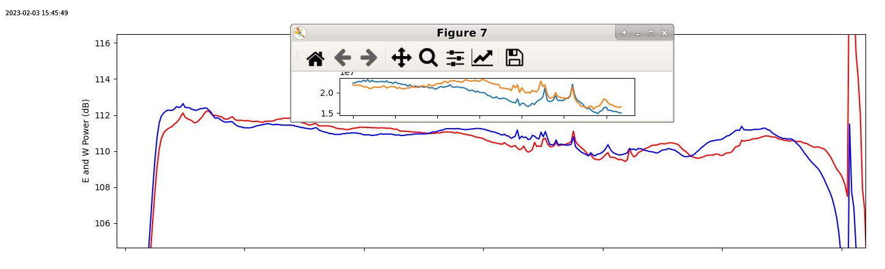
    - And we can see the bandpass for the PFB chans
      - 
      - 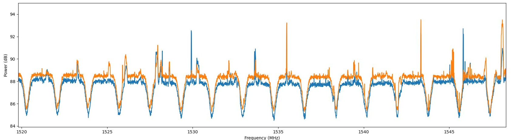


## 2023/02/01-02

- pulsar_mode_v0
  - Only -1, 0 on first 10G (out of band -> understandable)
  - On 7th 10G (ch=768..895, F=[1387.5..1616.94] MHz), with Channelizer.scale = 1, on feed=BF, samples follow gaussian distribution within [-80..80].
  - Issue with SPEAD format.
    - One 64-bit word shift
    - z^-1 is missing on data bus withrespect to dv/eof in pulsar_mode_v0/channelizer/frm*
    - Fixed
  - Start fit
  - Timing violations
  - Generate bitstream anyway for tests.


## 2023/01/31

- pulsar_mode_v0
  - Start fit
  - Same timing failure (-0.028ns slack) as before
  - Use XPS to generate bitstream anyway, save project
  - But checking "EDK/ISE/Bitgen" restarts all the way from synthesis
    - Can we only start bitgen?
    - i.e.: cd implementation ; bitgen -w -f bitgen.ut system ; cd ..
  - Anyway, after 2h, the bitstream is ready.
  - 10G links are not stuck anymore.
    - SEFRAM looks OK
    - First 10G interface prints (avr ~= 893.54MiB):
      ```
      19:19:51.380526 IP 192.168.5.20.10000 > 192.168.5.180.2002: UDP, length 8256
      19:19:51.380544 IP 192.168.5.20.10000 > 192.168.5.180.2004: UDP, length 8256
      19:19:51.380551 IP 192.168.5.20.10000 > 192.168.5.180.2005: UDP, length 8256
      19:19:51.380562 IP 192.168.5.20.10000 > 192.168.5.180.2006: UDP, length 8256
      19:19:51.380569 IP 192.168.5.20.10000 > 192.168.5.180.2007: UDP, length 8256
      ```
    - Dump some frames in pcap for later study


## 2023/01/30

- pulsar_mode_v0
  - 7 violations in fft0/fft_wideband_real  (> -0.104ns)
  - Generate bitstream anyway for test
    - Same as 2023/01/27, but generate bitstream from XPS gui.  And again, restarts map and PAR from start...
  - Need to improve fft area_group to make easier fits
  - sync_in is not latched in reorder, but only registered -> gets stuck at startup
    - Fix
  - Start fit
    - Forgot to check all boxes first: this time only creating bit map...
  - Start fit
    - Twice.  Error with some files in /tmp/xil*.  -> remove them all.


## 2023/01/29

- pulsar_mode_v0
  - comment out snap and fit
  

## 2023/01/27

- pulsar_mode_v0
  - Fit failed.
  - Planhead to make this snap diagnostic working
    - Nothing really helpfull to fix the fit.
  - Generate bitstream anyway.  Will run with lower ADC speed.
    - disable the PAR timing check
      - xps
      - open project 'pulsar_mode_v0/XPS_ROACH2_base/system.xmp'
      - Project > Project Options > Design Flow > and unselected the “Treat timing closure failure as an error” and finally save the project.
      - Select only EDK/ISE/Bitgen in CASPER_XPS
      - Run XPS
      - But recompile all design... (without XSG et IP generation)
  - Can see with snap that reorder is feeding data to SPEAD and then to 10G IPs when PPS has not occured.
    - Reorder submodules were not designed to wait for sync to start working, but are only reset by sync -> Add arm input that prevent reorder modules to transpose when sync has not occured.


## 2023/01/25-26

- pulsar_mode_v0
  - After struggling some time with the design it seems that no PPS is seen by the ROACH2
  - adc_c9r_sst_v5 doesn't really work either...
- Design and compile test_pps_v0
  - ADC interfaces + adcsnaps
  - ADC0_sync sent to counter sync_cnt, arm_pps and all leds
- No PPS found on WR-LEN
  - Not frozen but not outputing PPS
  - ptp stop start -> PPS ok
- pulsar_mode_v0
  - SEFRAM looks OK
  - But channelizer is stuck
    - Add snap between SPEAD framer and 10GbE yellow block to see why
  - Fix FPGA_ver constant -> 0x505352_00: PSR, V0
  - Start fit
  - Add PPS_present at the begining of config script


## 2023/01/23

- pulsar_mode_v0
  - Wrong FPGA_ver constant (still the one from 4f28 galactic mode)
  - Start writing script pulsar_mode_v0.py to test firmware
  - Fix FPGA_ver constant -> 0x505352_00: PSR, V0

- pulsar_mode_v1
  - Fix FPGA_ver constant -> 0x505352_01: PSR, V1


## 2023/01/16
- pulsar_mode_v0
  - PFB FIR
    - The PFB FIR is implemented on 16 mostly independant channels (only sync is common to all in*)
    - Split PFB area_group in 4 sections and distribute 4 lanes to each ones.
  - Start new fit
  - Typo in */sefram_*/pfb/pfb_fir_*/pol1_in* ...
  - Start new fit
  - Fit passed!!!!


## 2023/01/14
- pulsar_mode_v0
  - Timing violations (-0.5ns) in PFB FIR, mostly


## 2023/01/13

- pulsar_mode_v0
  - Timing violations (12 greater than -0.119):
    - pulsar_mode_v0/channelizer/frm0/spead_pack/add_sub
      - y = x - 1 with x mostly constant -> add a z^-1
    - pulsar_mode_v0/frmr/pck/edge_detect2
      - Replace SLR16 used for z^-1 by simple reg
      - Add reg after edge_detect2 (not time critical)
    - pulsar_mode/sefram/pfb/pfb_fir/pol1_in7_tap6/delay_bram
      - -0.059ns -> leave as-is.  Could fit in next PAR
  - Start new fit
    - Violations:
      - PFB
      - FFT
      - pulsar_mode_v0_x0/channelizer/frm0/runt_gen/or gate -> add register
  - Start new fit


## 2023/01/11

- pulsar_mo
- de_v0
  - -0.425 ns de slack (pipeline vers channelizer)
  - Change AREA_GROUP
  - Start new fit
  - -0.827 ns slack on 77 points
  - PlanAhead
    - SRL16 found in nrt_bw1800_ch1024_fft_core/fft_wideband_real/fft_biplex_real_4x/biplex_core/fft_stage_7/butterfly_direct/shift_replicate
      - Left as-is for now
    - SRL16 found in nrt_bw1800_2pols_ch1024_8taps_pfb_core/pfb_fir/pol1_in1_last_tap/pfb_add_tree/convert[12]
      - Add latency used for convert latency there.  Implementing z^-2 with SRL16.
      - Reduce latency to 1
      - Generate pfb
      - resynth_netlist('nrt_bw1800_2pols_ch1024_8taps_pfb_core')
  - Start new fit


## 2023/01/10

- pulsar_mode_v0
  - -0.3 ns de slack (pipeline vers channelizer)
  - Start new fit with more effort during PAR


## 2023/01/09

- pulsar_mode_v0
  - Add AREA_GROUP and KEEP on
    - `*/pulsar_mode_v0_x0/adc1_*/converter*`
    - `*/pulsar_mode_v0_x0/adc1_*/pipeline*`
  - Start fit
  - `ERROR:ConstraintSystem:58 - Constraint <NET "*/pulsar_mode_v0_x0/adc0_*/pipeline*" KEEP=TRUE;> [system.ucf(1001)]: NET "*/pulsar_mode_v0_x0/adc0_*/pipeline*" does not match any design objects.`


## 2023/01/06

- Config serveur
  - NRT off. Retreive serveur to push script on git for Louis
  - Network conf is located in /etc/NetworkManager/system-connections
- pulsar_mode_v0
  - Same timing violations.
    - `-equivalent_register_removal off;` makes no difference
  - Trying `NET "net_name" KEEP=TRUE;` on:
    - sys_block_inst/sys_block_inst/fab_clk_counter
    - all other free running regs used in ffts and pfb that drive delays
      - pulsar_mode_v0_x0/sefram/fft0/fft_wideband_real/fft_biplex_real_4x/bi_real_unscr_4x/delay1/counter
        ```
          NET "sys_block_inst/sys_block_inst/fab_clk_counter_*" KEEP=TRUE;
          NET "*/delay*/counter/count_reg_*" KEEP=TRUE;
        ```
  - Fit failed (Slack > -1.2ns)
    - But -2.8 ns slacks related to `sys_block_inst/sys_block_inst/fab_clk_counter` are now gone.
    - Still some violations to address but look more classical.


## 2023/01/05

- pulsar_mode_v0
  - Timing violation < -2.8 ns
    - Lots involving sys_block_inst/sys_block_inst/fab_clk_counter_31
      - This counter is a free running counter
      - It is very similar to the ones used to implement digital delay lines in the design.
      For example: pulsar_mode_v0_x0/sefram/fft0/fft_wideband_real/fft_biplex_real_4x/bi_real_unscr_4x/delay1/counter
      - Try "equivalent_register_removal off" during map to prevent these registers to be merged.
      - Search for a way to do it in the ucf file instead in , 
        - `NET  "net_name"      KEEP=TRUE;`
        - `INST "instance_name" KEEP_HIERARCHY=TRUE;`
    - Some involving ADC[01] interface
      - will look later at that.
  - Start map with
  `map -timing -detail -ol high -xe n -mt 2 -global_opt speed -equivalent_register_removal off -o system_map.ncd -w -pr b system.ngd`
    - OK
  - Start par with 
  `par -xe c -w -ol high -mt 4 system_map.ncd system.ncd system.pcf`
    - OK
  - Start post_par_trce with
  `trce -e 200 -xml system.twx system.ncd system.pcf`
  - Same timing violations....  Something gone wrong with manual commands?
  - Start fit with fast_runtime.opt map section modified
  `-equivalent_register_removal off;`


## 2023/01/03

- pulsar_mode_v0
  - Timing violation < -0.7 ns
  - Reinsert PFB


## 2023/01/02

- pulsar_mode_v0
  - timing violations between
    - pipe_data12, channelizer/rescale, frmr/crosspower
    - pulsar_mode_v0_ten_Gbe0/tge_tx_inst
    - pulsar_mode_v0_ten_Gbe6/tge_tx_inst
  - Change area_group positions
  - Start fit


## 2023/01/01

- pulsar_mode_v0
  - Replace SEFRAM by simple frame generator (SEFRAM_like)
  - Start fit
    - just a -0.029ns violation on TGbE4_valid (phy_0_grp)
  - Put back SEFRAM, but with apodisation instead of pfb
  - Start fit
    - timing violations between
      - pipe_data12, channelizer/rescale, frmr/crosspower
      - pulsar_mode_v0_ten_Gbe0/tge_tx_inst
      - pulsar_mode_v0_ten_Gbe6/tge_tx_inst


## 2022/12/30
- pulsar_mode_v0
  - In /FAN/HDD2/CASPER/mlib_dev/xps_base/XPS_ROACH2_base/etc/fast_runtime.opt, changing:
    ```
    -register_duplication on;
    -equivalent_register_removal off;
    -global_opt speed;
    ```
  - Start fit
    - Not better
    - Add z^-1 in 10G led drivers to ease timing closure
    - In /FAN/HDD2/CASPER/mlib_dev/xps_base/XPS_ROACH2_base/etc/fast_runtime.opt, remove `-register_duplication on;` as it conflicts with `equivalent_register_removal`
  - Start fit
    - Failed


## 2022/12/21

- pulsar_mode_v0
  - Move "sys_block_inst/sys_block_inst/*" in AREA_GROUP = "TenGs_grp"
    - Not better
  - Could be that this counter has equivalents in the design and they get merged.


## 2022/12/19

- pulsar_mode_v0
  - Comment out framer and 1GbE for SEFRAM to seee if we can get a fit.
  - Start fit
  - Same violations:
    - -1.5ns to -0.3ns : sys_block_inst/sys_block_inst/fab_clk_counter_31
  - Try to move it somewhere less dense


## 2022/12/05

- pulsar_mode_v0
  - Back to fit.
  - Open back floor planner to fix place errors (not enought space for DSP48E1 and LUT for seframFFT1_direct_unscram_grp)
  - Just a typo: both seframFFT[01]_direct_unscram_grp assigned to seframFFT1_direct_unscram_grp
  - Start fit
  - Timing violations:
    - sefram/pipe_fft0  ->  pipe_data0
  - Fix AREA_GROUP pour pipe_fft0
  - Start fit
  - Timing violations:
    - -1.5ns to -0.3ns : sys_block_inst/sys_block_inst/fab_clk_counter_31   -> What is that?
    - -0.2 ns in pfb


## 2022/11/22

- pulsar_mode_v0
  - Fit failed.  Timing violations 
  - Add some constraints on the pipeline between SEFRAM, sefram_frmr and channelizer
  - Start fit

- Galactic and extragalactic mode
  - Instead of only implementing 2 receivers for 112MHz of band for the extragalactic mode, we could do 4 with 112 or 28 MHz that could be used for both modes.


## 2022/11/21

- pulsar_mode_v0
  - replace SEFRAM, frm and 1G by simple counters to feed the channelizer
  - start fit
  - Fit OK
  - Shrink AREA_GROUP for reorder (failure was probably a typo on the 2022/11/19)
  - Fit OK
  - Replace counter by SEFRAM+frm+1G
  - Start fit
  - Almost good.   Just some violation on 10G MAC that can be fixed with an AREA_GROUP
  - Generate nrt_bw1800_2pols_ch1024_8taps_pfb_core
  - resynth_netlist('nrt_bw1800_2pols_ch1024_8taps_pfb_core')
  - Integrate
  - Improve AREA_GROUPs for this design
  - Start fit


## 2022/11/20

- pulsar_mode_v0
  - fit too long
  - Will probably never end
  - Killed


## 2022/11/19

- pulsar_mode_v0
  - AREA_GROUP too small for reorder.
  - Start fit 


## 2022/11/18

- pulsar_mode_v0
  - Fix AREA_GROUPs
  - Start fit several times


## 2022/11/16

- pulsar_mode_v0
  - Add AREA_GROUPs for SEFRAM and framer
  - Start fit

- Check transposition behavior
  - 
  - In stream:  8 chan per ticks for 128 ticks
    - [   0,    8,   16, ..., 1000, 1008, 1016,       0,    8,   16, ... ]
      [   1,    9,   17, ..., 1001, 1009, 1017,       1,    9,   17, ... ]
      [   2,   10,   18, ..., 1002, 1010, 1018,       2,   10,   18, ... ]
      ...,                                                  
      [   5,   13,   21, ..., 1005, 1013, 1021,       5,   13,   21, ... ]
      [   6,   14,   22, ..., 1006, 1014, 1022,       6,   14,   22, ... ]
      [   7,   15,   23, ..., 1007, 1015, 1023,       7,   15,   23, ... ]
  - Out streams: 8 streams of 2 chan per ticks for 64 ticks  -> 128 chan, 16 samples per 10G
    - [  0,   2,   4,   6, ..., 120, 122, 124, 126,       0,   2,   4,   6, ..., 120, 122, 124, 126, ...]
      [  1,   3,   5,   7, ..., 121, 123, 125, 127,       1,   3,   5,   7, ..., 121, 123, 125, 127, ...]       
    - [128, 130, 132, 134, ..., 248, 250, 252, 254,     128, 130, 132, 134, ..., 248, 250, 252, 254, ...]
      [129, 131, 133, 135, ..., 249, 251, 253, 255,     129, 131, 133, 135, ..., 249, 251, 253, 255, ...]
    - ...
    - [896, 898, 900, 902, ..., 1018, 1020, 1022,       896, 898, 900, 902, ..., 1018, 1020, 1022, ... ]
      [897, 899, 901, 903, ..., 1019, 1021, 1023,       897, 899, 901, 903, ..., 1019, 1021, 1023, ... ]
  - But we may prefer to send 16 samples for chan0, 16 samples for chan1, ... and then 16 samples for chan 127  (ch_t)
    - [ 0_0, 0_2, ..., 0_14,     1_0, 1_2, ..., 1_14,    ...,     126_0, 126_2, ..., 126_14,     127_0, 127_2, ..., 127_14 ]
      [ 0_1, 0_3, ..., 0_15,     1_1, 1_3, ..., 1_15,    ...,     126_1, 126_3, ..., 126_15,     127_1, 127_3, ..., 127_15 ]
    - Could be done by writing even and odd samples in 2 different memories (half the size), that would be read back in // to output [n, n+1] samples at the same time.
      - Start working on reorder_v1_sim to implement this.


## 2022/11/15

- Test pulsar_test_10g_v1
  - Make port ranges the same for all 10G interfaces
    - Only one TGbEs_dst_port_cfg/TGbEs_dst_port_wr for all 10Gs.
  - Fit and test.
  - Sometimes, all 10G overflow when design starts
    - On all streams (at once?)
    - Could be the freerunning period counter not being reset -> add reset
  - Fit
  - Timing issue in comparator+OR logic, fixed
  - Fit
  - Bug in enable/rst
  - Fit and test ok (5-10 starts without issue)
  - This validates the 10G streams test setup and the logic locks for 8 10G interfaces.
  - Moving on to the transposition now.
  - Clone as pulsar_mode_v0 


- Pulsar mode packet format:
  - channel organisation in 10G streams
  - 1024 channels, 8 lanes/10G_if
  - 128 channels per lane
  - 1 sample is complex, polarized, 8-bit signed data -> 32 bits/4 bytes
  - One jumbo frame can fit 8192 bytes --> 2048 samples
  - One 10G_if could send its payload to P different UPD ports feeding P recording processes:
      -   1 packet  / if of (128 channels x   16 samples) / packets.
      -   2 packets / if of ( 64 channels x   32 samples) / packets.
      -   4 packets / if of ( 32 channels x   64 samples) / packets.
      -   8 packets / if of ( 16 channels x  128 samples) / packets.
      - 128 packets / if of (  1 channel  x 2048 samples) / packets.
      -   P packets / if of (  C channels x    D samples) / packets.
          -   C = 128/P
          -   D = 2048/C = 16.P
  - Each 10G_if would need to double-buffer S = P.C.D samples
    - S = P.C.D = P (128/P) (16 P) = 2048 P
    - 32 bits/samples and 2 buffers of OnChip RAM to double-buffer these packets
    - Buffer_size_per_10G = P x 2048 x 32 bits x 2 buffers = 131072.P bits
  - For all 8 10G_ifs, that adds up to 8 x Buffer_size_per_10G = 1048576.P bits
  - The XC6VSX475T FPGA embbeds 1064 RAMB36 of 36 kb that can be configured as 1K x 36 bits.
  - So we roughtly need P * 1048576/36kb = 29 x P RAMB36, but our datapath is 32 or 64 bits
  - So more precicely, we need P x 2048 / (1Kword RAMB36) x 32 bits / (32-bit word RAMB36) x 2 buffers x 8 10G_ifs = 32 x P = (3P)% of available RAMB36
  - So, we have plenty of RAMB36 to accomodate P = {2, 4, 8, ...}, but not for P=128 (384% of RAMB36)

- pulsar_mode_v0
  - Integrate and modify
  - Start fit, but still running after > 10h -> kill PAR


## 2022/11/14

- Test pulsar_test_10g_v0
  - Free current SEFRAM recording with `killall udpsefram`
  - Design looks ok.
  - Duplicate rst for 10G and enable for sim_streams
  - 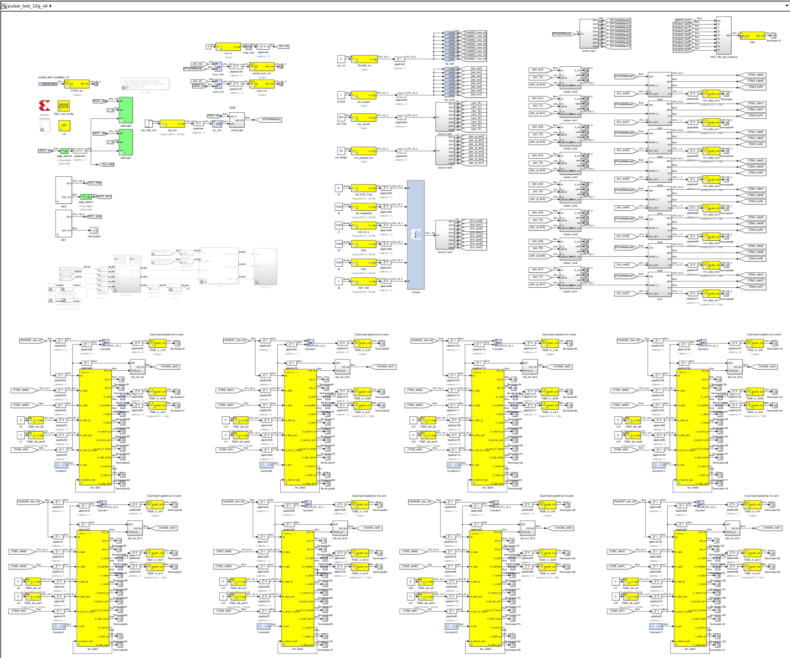
  - Clone as pulsar_test_10g_v1 to test round_robin IP:UDP

- Test pulsar_test_10g_v1
  - Add round_robin on 10G0
  - 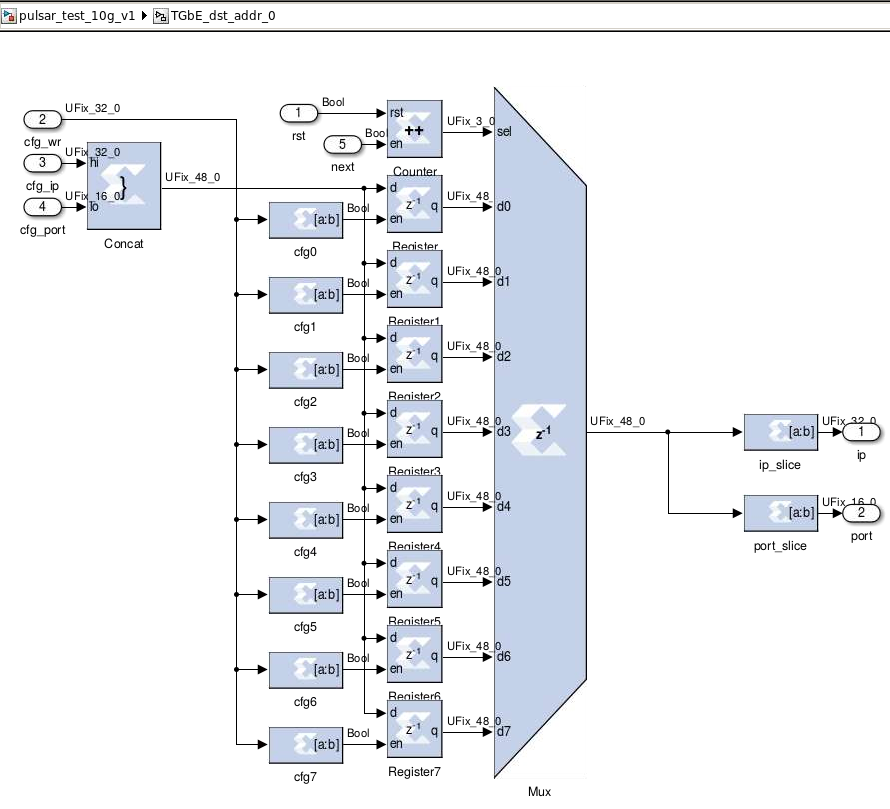
  - Looks good.
      14:08:52.725506 IP 192.168.5.20.10000 > 192.168.5.180.10000: UDP, length 8256
      14:08:53.725506 IP 192.168.5.20.10000 > 192.168.5.181.10001: UDP, length 8256
      14:08:54.725510 IP 192.168.5.20.10000 > 192.168.5.182.10002: UDP, length 8256
      14:08:55.725507 IP 192.168.5.20.10000 > 192.168.5.183.10003: UDP, length 8256
      ...
  - but missing second IP:port at start (extra eop due to armed_pps)
    - Separate force_eof from armed_pps
    - Fixed in pulsar_test_10g_v1_2022_Nov_14_1610
  - Only make port configuration in a round-robin distribution, no reason to do it on IPs too.
  - Replicate this scheme on all 10Gs

- pulsar_mode
  - Meeting regarding subband distribution on 10G links
    - 1024 sb, 8 if
    - 128 sb/if
    - 1, 2 or 4 recording processes  -> 1, 2, 4 different destination IP:port
    - What does this imply in term of FIFO depth, transposition and framinf on the FPGA side
    - GPU-Direct could handle 1 process directly, but we are not sure to implement it quickly.


## 2022/11/12

- pulsar_test_10g_v0
  - Change hierarchie design
  - Fix errors
  - Add xaui_phy_? in region_locks
  - Start fit -> success

- extragalactic mode
  - Still trying to figure out how FFT is implemented...


## 2022/10/18

- pulsar_test_10g_v0
  - planAhead: identify each xaui-phy-10G and create AREA_GROUPs
  - Fit fails in
    - pulsar_test_10g_v0_x0/pipeline6 -> pulsar_test_10g_v0_x0/tgbe?  (large fan out? -> Make fanout tree)
    - pulsar_test_10g_v0_TGbE0_ten_Gbe_rst -> pulsar_test_10g_v0_x0/tgbe?  (large fan out? -> Make fanout tree)
    - xaui_phy_7  -> forgot to put in AREA_GROUPs
  - Modify ucf and design
  - Start fit.
  - Fit fails in
    - fanout_tree1 -> tgbe4
    - pulsar_test_10g_v0_TGbE7_ten_Gbe_rst-> pulsar_test_10g_v0_XSG_core_config/pulsar_test_10g_v0_x0/tgbe
    - pulsar_test_10g_v0_TGbE7_ten_Gbe/pulsar_test_10g_v0_TGbE7_ten_Gbe/tge_tx_inst/ip_length -> pulsar_test_10g_v0_TGbE3_ten_Gbe/pulsar_test_10g_v0_TGbE3_ten_Gbe/tge_tx_inst/ip_checksum
    - planAhead for evaluation
    - Missing some z^-1 on 10G?  Add some after rst_core and sync
  - Start fit.


- extragalactic mode:
  - PFB ch16, 8-tap seems to be generatable after all...
  - fft_wideband_real 2^5 pts, 2^4 sim inputs seems to be generated if "unscamble output" is deactivated.
    - But "manually" unscrambling 16 channels (on 8 lanes) is possible.
    - However, fft_biplex_real_4x is broken
  - Trying fft_biplex_real_2x
    - doc: "A real-sampled biplex FFT, with output demuxed by 2."   32 samples in, 16 chans out ?
    - Looks OK
    - Simulation nrt_bw1800_ch16_fft_biplex_core_sim.slx
    - But no...  That's 16 real streams in, not 16 samples in //.
    - Asking CASPER on Slack, # mlib_devel channel.
      - 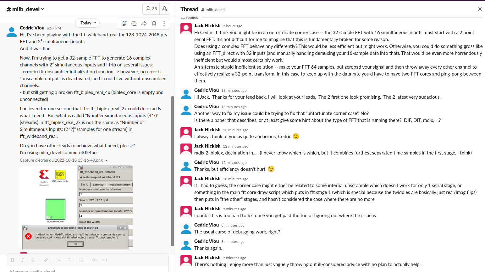
    - Generate fft (complex FFT suggested by Jack) side to side to fft_wideband_real for comparison.
    - The complex FFT's fft_biplex breaks the same way the fft_wideband_real's fft_biplex_real_4x does.  It might be easier to look into the complex FFT first for debugging.
    - Put side by side complex FFT 32 pts and complex FFT 64 pts
    - 


## 2022/10/17

- pulsar_test_10g_v0
  - Extra entries on ucf -> clean them
  - Start fit.
  - Failed (-1ns slack) on xaui_phy_7
  - Look at best location for 10G streamers with planAhead
  - Put xaui_phy_? in 10G area_group
  - Start fit.
  - Failed


## 2022/10/16

- pulsar_test_10g_v0
  - Fit failed (-0.5ns slack on 10G)
  - Add area_group for them
  - Start fit.
  - Fit failed (-3.2ns slack on 1G)
  - Add 1G core in area_group
  - Start fit.
  - Fit failed (-0.3ns slack on frmr/power_vacc and tgbe counters)
  - Comment out SEFRAM to have the 10G streamers ready to test tomorrow, hopefully
  - Start fit.

- Pulsar mode:
  - channel organisation in 10G streams
  - 1024 channels, 8 lanes/10G_if
  - 128 channels per lane
  - 1 sample is complex, polarized, 8-bit signed data -> 32 bits/4 bytes
  - One jumbo frame can fit 8192 bytes --> 2048 samples
  - If 128 channels are packed together, that's 16 samples max per channels
  - Is it better to send 2048 samples for one chan before going to the next one?
    - Impossible since required buffers reach up to 2048x1024x4 bytes = 8MB (twice that for double buffer)
    - But could be 8 packets of (16 channels x 128 samples) per packets.
  


## 2022/10/15

- galactic_h1_4x28mhz_v1
  - Start fit
  - Error on ucf name (old galacticHI_4x28MHz_v1.ucf)
  - Change ucf in design to ./galactic_h1_4x28mhz_v1.ucf
  - Start fit
  - Starts ok: removing Caps in galacticHI_4x28MHz_v1 fixed Error "XSG not compiled"
  - Fit successful (04:28)

- Caps in design name error checking:
  - Save galactic_h1_4x28mhz_v1 as galactic_H1_4x28mhz_v1
  - Start fit
  - Failing with :
    ```
    Error detected running CASPER XPS:
    Cannot find any compiled XSG netlist.  Have you run the Xilinx System Generator on your design ?
    ```

- pulsar_test_10g_v0
  - Cloned from galactic_h1_4x28mhz_v1
  - Remove channelizer, channel selector
  - Add 8 stream generators, SPEAD framers and 10G interfaces
  - Issue with long names in hierarchie (63 char max).
  - Rename and start fit several times...


## 2022/10/14

- adc_c9r_sst_v5.slx
  - SEFRAM:
    - No coherence at all between polarization (there was in previous designs...)
    - fft_shift was set incorrectly (0b010111: copy-paste channelizer config)
    - Saturation probably (but not seen...)
    - With fft_shift_reg = 0b1111111111, coherency is back
    - 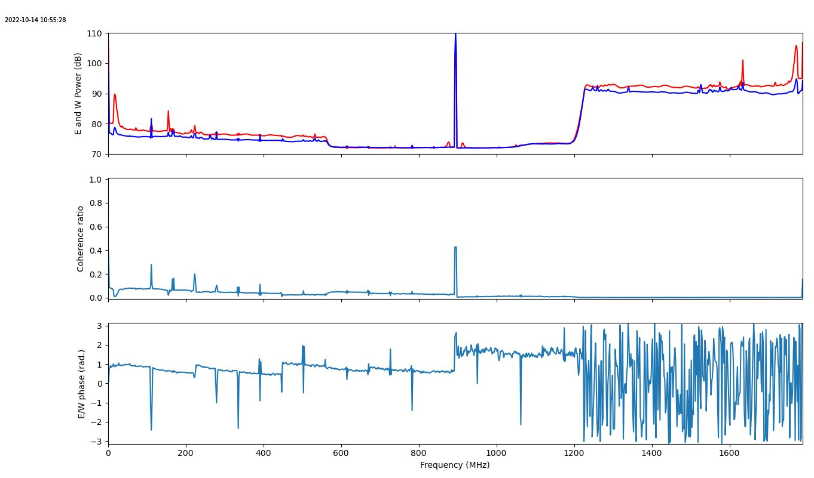

- NRT test setup
  - Change channelized dst UDP port : 0xcece -> 0xdede

- Discussion on next developpemnts
  - Pulsar mode:
    - Generate quick design that generates dummy packets at a realistic pace on all 8 10G interfaces
    - Test transpose and implement full solution
      - 1 FFT for channelizer and SEFRAM
  - ADC calibration
  - Extragalactical HI mode (2x112MHz)

- Clone galacticHI_4x28MHz_v1.slx from adc_c9r_sst_v5.slx
  - with ucf and backups of pcores (.slx, .vhd, _config.m) in galacticHI_4x28MHz_v1_pcores
    - ./nrt_bw1800_2pols_ch1024_win_hamming_core
    - ./nrt_bw1800_ch1024_fft_core
    - ./nrt_bw1800_2pols_ch64_12taps_pfb_core
    - ./nrt_bw1800_ch64_fft_core
  - Add FPGA_ver reg at top with content: 0x4f28_0001 (4x28MHz, V1)
  - Start fit
  - Error "XSG not compiled" -> High Capitals in design name?
  - Start fit with adc_c9r_sst_v5 with latest modifications for test
  - Fit successful (04:27)

- Pulsar mode
  - Compute 10G datarates on pulsar mode
    - 1024 channels
    - 3700 MS/s max sampling rate
    - 3700/2048 MS/s = 1.81 MS/s max
    - 8 lanes, 8 10G interfaces
    - 128 channels per lanes
    - 231,25 MS/s per lanes
    - Samples are complex, polarized, 8-bit data (4bytes/sample)
    - 231,25 * 4 = 925 MB/s/lanes
    - Max datarate = 10Gb/s = 1250 GB/s
    - Average datarate = 925/1025 = 74% + framing (header, UDP, IP) 


## 2022/10/13

- adc_c9r_sst_v5.slx
  - Test firmware
  - Programs and configures properly
  - 
  - SEFRAM:
    - No coherence at all between polarization (there was in previous designs...)
      - Regression or improvement?
        - Regression.
          - Splitting one pol and feeding them to both ADC channels shown no coherence at all -> bug in correlator (adc_c9r_sst_v5/frmr/crosspower_vacc) or in adc_c9r_sst_v5/channelizer/[pfb|fft] since autocorr show much stronger levels than previous 2048-ch versions.
        - Search bug in design, make frmr clearer (rename signals and interfaces)
    - 1024 channels
    - byte-swap
  - Channelizer:
    - Quick integration on 1421 MHz: Galaxy is present


## 2022/10/12

- adc_c9r_sst_v5.slx
  - Fit successufull (4:38)
  - info_block left in top.  Prevents fpga configuration.
  - Remove block and start fit.
  - Fit successufull (4:28)


## 2022/10/11

- nrt_bw1800_ch64_fft_opt_org_comparison.slx
  - Compare 64chan fft in casper original version and optimized version  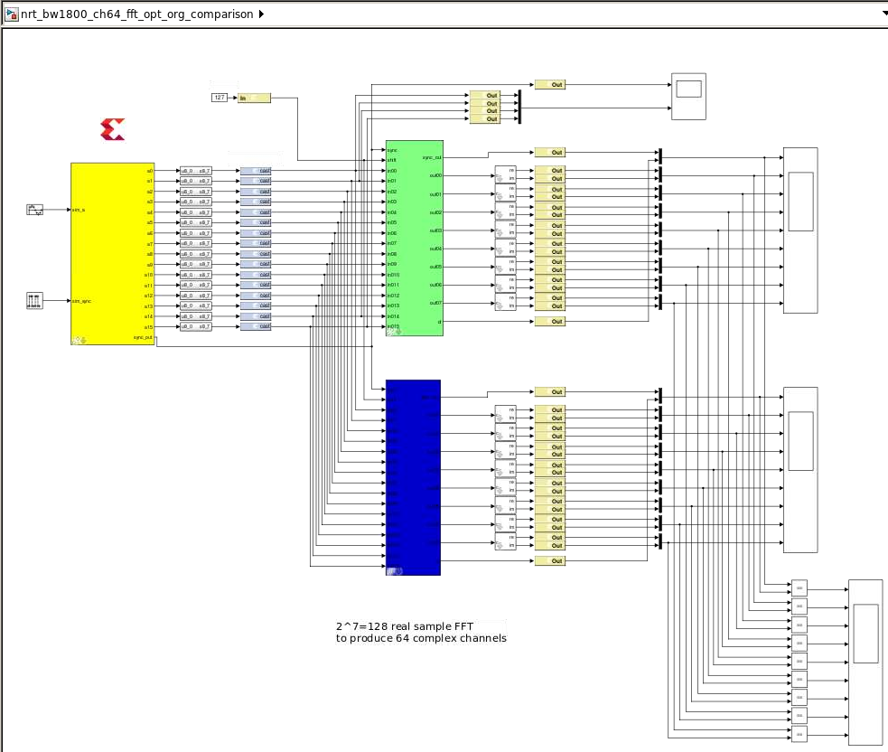
  - Found a bug in optimized cosin
  - Fixed
  - Both implementations are now behaving the same way (on a sine at least...)
- nrt_bw1800_ch64_fft_core
  - regenerate optimized wide_band_fft
  - resynth_netlist('nrt_bw1800_ch64_fft_core')
- nrt_bw1800_ch1024_fft_core
  - regenerate optimized wide_band_fft
  - resynth_netlist('nrt_bw1800_ch1024_fft_core')
- adc_c9r_sst_v5.slx
  - Start fit


## 2022/10/04

- Matlab interface
  - Extremely small font size.  Can't read.
  - Create /FAN/HDD2/CASPER/resize_msgbox.m to resize current error message box

- nrt_bw1800_ch64_fft_opt_org_comparison.slx
  - Issue when generating design with biblex_core -> extra yyyyyyy in code -> silent error, not generating model


## 2022/10/03

- nrt_bw1800_ch64_fft_opt_org_comparison.slx
  - Instanciate fft_wideband_real from
    - CASPER DSP FFTs
      - Original code from CASPER (with some optimization already that should be moved back to FFTs_cc)
    - CASPER DSP FFTs_cc
      - First replicate .mdl and .m to host optimisations
      - Change background color to blue for optimized blocks
  - Declaring casper_log_groups={'all'} in matlab transcript
    - prints all clog from init scripts.


## 2022/10/01

- adc_c9r_sst_v5.slx
  - Fit
  - Fit sucessful


## 2022/09/30

- adc_c9r_sst_v4.slx
  - Fit failed with 2 -0.01ns violation on fft_shift (static signal)
  - Force bitstream generation
    ```bash
    adc_c9r_sst_v4/XPS_ROACH2_base$ bitgen -w -f bitgen.ut system
    ./gen_prog_files
    ```
  - SEFRAM not working
  - Strange data on channelizer (RFI?)
  - Clone as adc_c9r_sst_v5 for debug

- adc_c9r_sst_v5.slx
  - Add snap on fft outputs for debug.
  - Start fit
  - Fit gailed on fft_shift -> region locked in ffts
  - Extract regs from ffts


## 2022/09/29

- adc_c9r_sst_v4.slx
  - Fit failed (SEFRAM fft_wideband) for 130 violations (-1.46ns to -0.7ns)
  - PlanAhead to add AREA_GROUPs
    - sefram_*/fft[01]/fft_wideband_real_*/fft_direct + sefram_*/fft0/fft_wideband_real_*/fft_unscrambler
    - sefram_*/fft[01]/fft_wideband_real_*/fft_biplex_real_4x_
  - Start fit
  - Some erros in ucf, fix and rerun directly *map -timing -detail -ol high -xe c -mt 4 -register_duplication on -global_opt on -o system_map.ncd -w -pr b system.ngd system.pcf*
  - Change channelizer PFB to 8-tap PFB
  - Generate nrt_bw1800_2pols_ch64_12taps_pfb_core for later (should fit in channelizer_pfb_grp AREA_GROUP)
  - resynth_netlist('nrt_bw1800_2pols_ch64_12taps_pfb_core')


## 2022/09/28

- adc_c9r_sst_v4.slx
  - Fit failed in 3 locations (SEFRAM fft adders) for 130 violations
  - Add block_info and rcs blocks
  - Start fit
  - fpg file corrupted because debug info added into mlib_devel_GIT/xps_library/get_git_info.py
  - Try to fix things but destroy bit file.
  - Restart fit
  - Same corrupted fpg.  Could be block_info and rcs blocks -> remove them
  - Start fit


## 2022/09/27

- adc_c9r_sst_v4.slx
  - Fit ok with larger AREA_GROUP for channelizer PFB
  - Channelizer looks ok but low number of taps -> will increase that now we can.
  - SEFRAM looks as bad
    - Found several bug in framer due to hardcoded constants
    - Rewrite mask to generate good values from nof_chans
  - Start fit


## 2022/09/26

- adc_c9r_sst_v4.slx
  - Extract led driver from 10G module to prevent z^-2 falling into AREA_GROUP and failing timings
  - Start fit

- casper_library
  - Clone as casper_library_cc
  - Not working (path masking each other)
  - Dupplicate FFT (and others) sublibs


## 2022/09/23

- adc_c9r_sst_v4.slx
  - Fit successfull!!!
  - But SEFRAM looks bad -> forgot to change nof_chan_w to 7 in frmr/acc_cntrl
  - PFB looks strange, but nof tap = 4 instead of 16 and found skewed delay between data_out and sync_out in channelizer
  - start fit
  - Fit successfull
  - Backup adc_c9r_sst_v4.ucf.bak_20220923 and reduce AREA_GROUPs to make more place for channeliser PFB
  - start fit
  - Fit failed with 28 -0.752ns slacks 


## 2022/09/22

- adc_c9r_sst_v4.slx
  - Fit failed with 4 -0.252 to -0.215ns slacks !
    - Source:      .../channelizer/fft0/fft_wideband_real/fft_biplex_real_4x/biplex_core/fft_stage_2/butterfly_direct/twiddle/mux1/pipe_16_22_0_30 (FF)
    - Destination: .../channelizer/fft0/fft_wideband_real/fft_biplex_real_4x/biplex_core/fft_stage_2/butterfly_direct/bus_sub/addsub6/comp6.core_instance6/blk00000001/blk00000004/DSP48E1 (DSP)
  - AddSub implemented with DSP48???  Such a waste!
  - Backup as nrt_bw1800_ch64_fft_core_bak20220922
  - Regenerate nrt_bw1800_ch64_fft_core with adder not implemented in DSP48
  - resynth_netlist('nrt_bw1800_ch64_fft_core')
  - start fit


## 2022/09/21

- adc_c9r_sst_v4.slx
  - Fit failed with -slacks on sefram/fft/twiddle/cosin/negate
  - Modify invert_init in cosin_init to replace xbsIndex_r4/Negate by (xbsIndex_r4/Constant(0) , xbsIndex_r4/AddSub)
  - generate nrt_bw1800_ch1024_fft_core
  - resynth_netlist('nrt_bw1800_ch1024_fft_core')
  - start fit
  

## 2022/09/20

- adc_c9r_sst_v4.slx
  - Fit failed with one -0.3ns slack and 78 -0.1ns slacks
  - Removed 10G packet counter led blinker
  - Timing violations in z^-2 adders.  They use SRL16...
  - Set back adders to z^-1
  - Generate nrt_bw1800_ch1024_fft_core
  - resynth_netlist('nrt_bw1800_ch1024_fft_core')
  - start fit


## 2022/09/20

- adc_c9r_sst_v4.slx
  - Fit failed because of routing delay between channelizer fft unscrambler and rescale unit located in AREA_GROUP
  - Add reg between them
  - start fit
  - Failed with -0.4ns slack
    - Some in apodisation (coef fanout befor mult) -> add regs
    - Some in sefram fft coef generator, between rom output and SRL16 input
  - Add fanout regs in apodisation
  - resynth_netlist('nrt_bw1800_2pols_ch1024_win_hamming_core')
  - start fit


## 2022/09/17-19

- adc_c9r_sst_v4.slx
  - Add misc_grp AREA_GROUP for OneGbE, rescale, select_4f64, TenGbE0
    - Better timing (only failing in fft_sefram adders : -0.6ns)
  - Regenerate FFT1024 for SEFRAM with latency=2 for adder
  - resynth_netlist('nrt_bw1800_ch1024_fft_core')
  - start fit


## 2022/09/16

- adc_c9r_sst_v4.slx
  - From adc_c9r_sst_v3.slx
  - With channelizer commented
  - SEFRAM:
    - Change endianness on header and data in adc_c9r_sst_v4/frmr/pck


## 2022/09/15

- Connect 2 WBA0030A amplifier (+23dB) - 3dB on ADCs
- SEFRAM
  - adc_sst_v5.1.py
  - 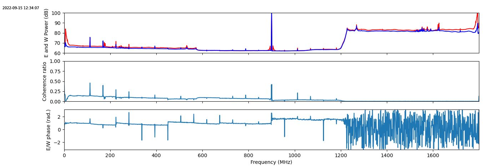
- Channelizer
  - adc_c9r_v4.py
  - Fe = 3580 MHz, chan 51, 0.73s
  - 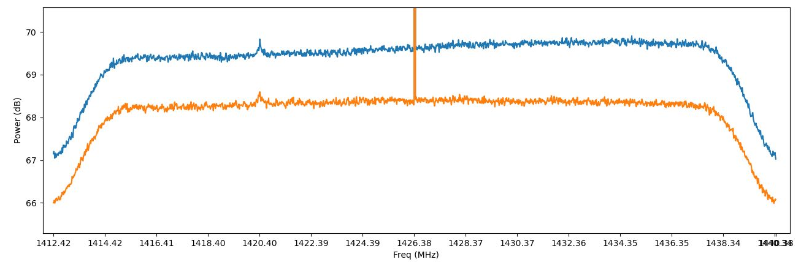
  - Fe = 3580 MHz, chan 51, 73s
  - 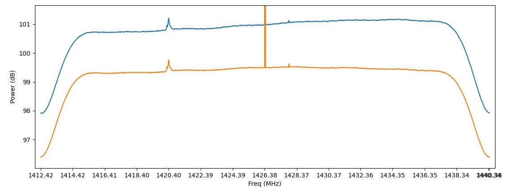
  - 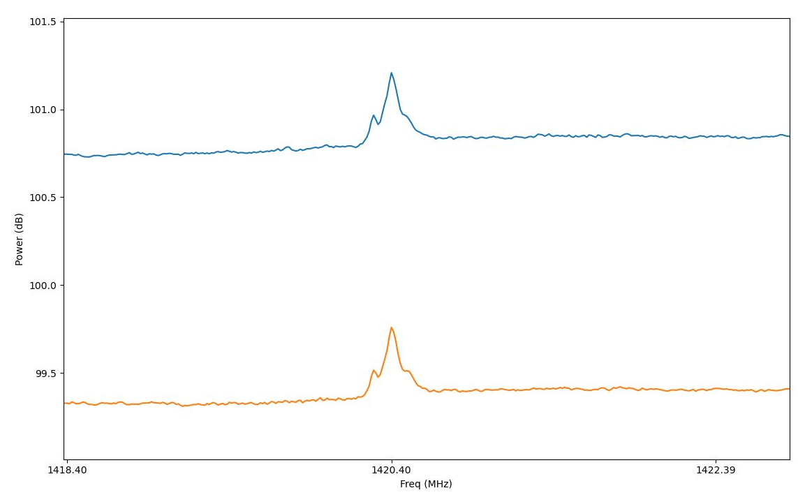


## 2022/09/14

- read_pcap.py
  - Integrate power spectrum from pcap recording
  - 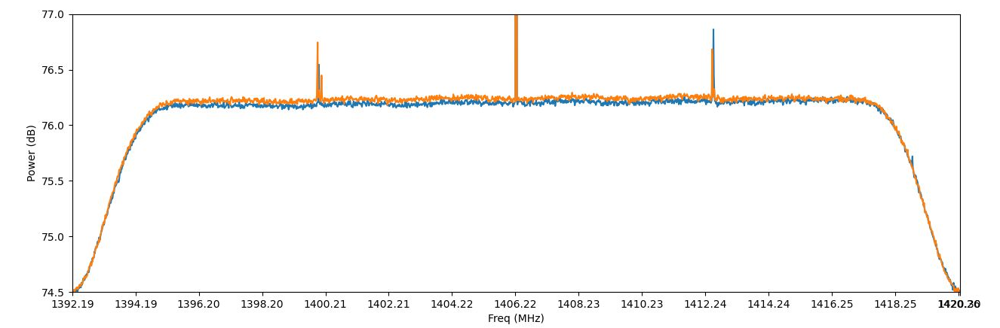
- vacc_packetizer_sim_sefram.py
  - Add realtime plot of EE, WW, rho et phy de EW
  - 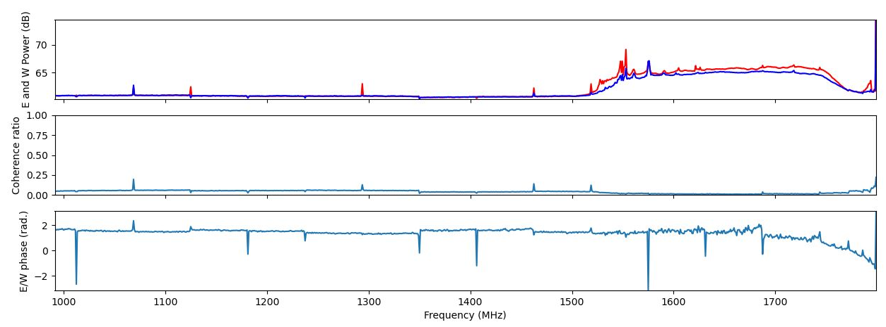
- RENARD:
  - Récepteur E???   Numérique Adressé au Radiotélescope Décimétrique


## 2022/09/13

- Deployment on NRT:
  - Valon, BF feed amplifiers, fibers, ...
  - acquisition -> renard moved to public network.
  - Fix inspect_stream.py, BHR_NRT.py, sefram.py to work on new setup
- RENARD
  - Install
    - libpcap0.8-dev
    - https://github.com/stamparm/pcapy-ng
    - impacket-0.10: python3 -m pip install impacket
  - Extract UPD payload with https://www.bortzmeyer.org/libpcap-python.html
  - Start writing read_pcap.py that extract SPEAD payload from TPC-UDP packets from a pcap dump and computes and accumulated spectra
  - First SEFRAM recording on Sky
  - 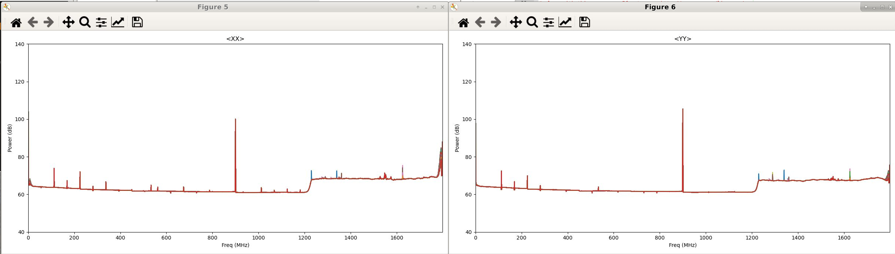
  - 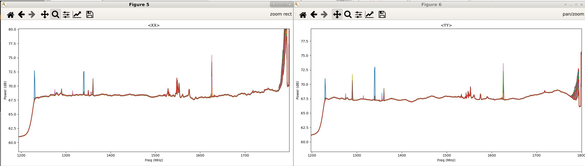
  - First BHR_NRT recording


## 2022/09/12

- Move test setup to NRT
  - 192.168.2.40:
    - acquisition
    - priv network connection to old_FNCU used to record 1G and 10G streams in Salle Horloge
    - to Switch PRIVE RT port 5
  - 192.168.2.41
    - pc viou
    - priv network connection to laptop that configure ROACH2 in cabine basse
    - to switch netgear in RF cabinet


## 2022/09/09

- Test 10G optical link
  - Roach2, SFP-10GLR-31 (FS.com), 25-m fiber, SFP-10GLR-31 (FS.com), copper5 -> OK


## 2022/09/06

- adc_c9r_sst_v3.slx
  - fit failed with -2ns in 10G and -1 ns in sefram fft adder
  - Regenerate fft1024 with adder lattency=1
  - resynth_netlist('nrt_bw1800_ch1024_fft_core')
  - fit failed mostly in adders...


## 2022/09/05

- Quick test with SEFRAM 1024ch (framer not modified!!!)
  - adc_c9r_sst_v3.slx
    - Cloned from adc_c9r_sst_v2.slx
    - Rename apodisation as apodisation_2048
    - Close apodisation_2048 as apodisation_1024
    - Generate apodisation_1024
    - Clone nrt_bw1800_ch2048_fft_core as nrt_bw1800_ch1024_fft_core
    - Generate nrt_bw1800_ch1024_fft_core
    - Generate apodisation_1024
    - black box apodisation 2048, 1024 (Ctrl-C from aopdisation)
    - link correct apodisations to adc_c9r_sst_v2 and adc_c9r_sst_v3
    - black box fft 1024 (Ctrl-C from fft 2048)
    - link fft 1024 to adc_c9r_sst_v3
    - fit failed -1.15ns slack, 320 errors mostly in adders (but forgot resynth_netlist)
    - resynth_netlist('nrt_bw1800_ch1024_fft_core')
    - resynth_netlist('nrt_bw1800_2pols_ch1024_win_hamming_core')
      - Going wrong...
      - rename apodisation_1024.slx to nrt_bw1800_2pols_ch1024_win_hamming_core.slx
      - generate nrt_bw1800_2pols_ch1024_win_hamming_core.slx
      - extract_entity
    - update links in adc_c9r_sst_v3
    - resynth_netlist
    - fit


## 2022/09/04

- Discussions SEFRAM et ressources.  À discuter:
  > Pour le mode galactique (PFB-FFT128) et extragalactique (PFB-FFT32), je vais continuer d'essayer d'optimiser les Win-FFT4096 du SEFRAM pour respecter les timing et donc fournir les 2 SEFRAM+Channelizer demandés.    Mais   > ça reste incertain...
  > 
  > Mais pour le mode pulsar (PFB-FFT2048), ça va être encore plus dur de faire rentrer tout le monde (PFB-FFT2048 + Win-FFT4096 + cornerturn_8x8 + 8 tramers 10G)...
  > 
  > Est-ce qu'il serait jouable de dégrader (aussi... :( ) le SEFRAM pour passer à 1024 canaux de 1.76MHz (au lieu de 2048 canaux de 0.9MHz)?  Donc une FFT2048 au lieu d'une FFT4096.
  > 
  > Pour le mode pulsar, il n'y aurait qu'un unique PFB-FFT2048 (au lieu d'un PFB-FFT2048 + Win-FFT4096).  Sa sortie serait dupliquée vers:
  > 
  >     SEFRAM (pfb, mieux que simple apodisation)
  >     et tramage 10G
  > 
  > Donc, c'est sûr de tenir.
  > 
  > Et pour rester cohérent avec les autres modes, on passerait les modes galactique (PFB-FFT128) et extragalactique (PFB-FFT32) avec un SEFRAM Win-FFT204: FFT moins lourde, peut-être plus facile à tasser avec le reste.  ET dans un second temps, peut être qu'on pourra remettre le  même PFB que pulsar à la place de l'apodisation (Win) pour être encore plus homogène).


## 2022/09/02

- fft_wide_band_real
  - 2^7 FFT -> OK
  - 2^6 FFT -> KO 


## 2022/09/01

- adc_c9r_sst_v2
  - Modify ucf with planHead
    - shrink apodisation area to minimum
    - add more space for sefram/fft*
  - fit failed with negative slacks on adders
    - Separate adders following cmult from adders generating twiddles?


## 2022/08/31

- fft_wideband_real
  - Those srl16 are really a pain.  In particular in bus_replicate where fanout is better with regs only
  - Modify /FAN/HDD2/CASPER/mlib_dev/casper_library/bus_replicate_init.m:107
  - Replace srl16 by reg-based pipeline
    ```matlab
    %reuse_block(blk, dname, 'xbsIndex_r4/Delay', ...
    %  'reg_retiming', reg_retiming, 'latency', '1', ...
    %  'Position', [xpos_tmp-del_w/2 ypos_tmp-del_d/2 xpos_tmp+del_w/2 ypos_tmp+del_d/2]);
    
    reuse_block(blk, dname, 'casper_library_delays/pipeline', ...
      'latency', '1', ...
      'Position', [xpos_tmp-del_w/2 ypos_tmp-del_d/2 xpos_tmp+del_w/2 ypos_tmp+del_d/2]);
    ```
  - Generate fft_wideband_real and nrt_bw1800_ch2048_fft_core
  - resynth_netlist('nrt_bw1800_ch2048_fft_core')
          '-register_balancing', 'yes', ...
          '-optimize_primitives', 'yes', ...
          '-read_cores', 'yes', ...
          '-max_fanout', '4', ...
  - fit failed with -2ns slack on invert in coef gen of twiddle fft
  - Set fft adder latency = 2
  - Generate fft_wideband_real and nrt_bw1800_ch2048_fft_core
  - resynth_netlist('nrt_bw1800_ch2048_fft_core')
          '-register_balancing', 'yes', ...
          '-optimize_primitives', 'yes', ...
          '-read_cores', 'yes', ...
          '-max_fanout', '4', ...
  - map failed (area too small for LUTM in sefram/fft*)


## 2022/08/30

- adc_c9r_sst_v2
  - Regenerate nrt_bw1800_ch2048_fft_core
    - not adder in DSP48
    - DSP instanciated
    - latency = 1 for all, except BRAM=2
  - resynth_netlist('nrt_bw1800_ch2048_fft_core')
          '-register_balancing', 'yes', ...
          '-optimize_primitives', 'yes', ...
          '-read_cores', 'yes', ...
          '-max_fanout', '4', ...
  - fit
  - Failing with -2ns slacks
    - Mostly in sefram/fft1/fft_wideband_real/fft_direct/butterfly1/twiddle/bus_mult*/mult*/a_replicate/din*_*/srl_delay
    - Where a simple register would do


## 2022/08/29

- mlib_dev
  - Change MAP and PAR options (xe c)
- adc_c9r_sst_v2
  - Cloned from adc_c9r_sst_v1
  - Replace 2-taps PFB for SEFRAM by apodisation
  - Backup nrt_bw1800_ch2048_fft_core
  - Regenerate nrt_bw1800_ch2048_fft_core
  - resynth_netlist('nrt_bw1800_ch2048_fft_core')
          '-register_balancing', 'yes', ...
          '-optimize_primitives', 'yes', ...
          '-read_cores', 'yes', ...
          '-max_fanout', '4', ...
  - Backup nrt_bw1800_ch64_fft_core
  - Regenerate nrt_bw1800_ch64_fft_core
  - resynth_netlist('nrt_bw1800_ch64_fft_core')
          '-register_balancing', 'yes', ...
          '-optimize_primitives', 'yes', ...
          '-read_cores', 'yes', ...
          '-max_fanout', '4', ...
  - fit failing mostly with -0.390 ns slack, in sefram FFT wide band coef gen DRAM and with -0.2 ns in channelizer FFT wide band DSP mult
  - planHead
  - Change sefram fft ch2048 to look like channelizer fft 64ch params:
    - Implementation: DSP48 adder in butterfly
    - Latency
      - BRAM 3->2
      - Convert 2->1
  - Regenerate fft 2048
  - resynth_netlist('nrt_bw1800_ch2048_fft_core')
          '-register_balancing', 'yes', ...
          '-optimize_primitives', 'yes', ...
          '-read_cores', 'yes', ...
          '-max_fanout', '4', ...
  - fit
    - Failed because fft now requires too many adders (464)
    - Restart from previous fft 2048, resynth and compile with -xe c for map and par
    - Failed with -0.4ns
  

- adc_c9r_v4.1
  - Implement channelizer module and integrate in adc_c9r_v4.1

## 2022/08/27

- adc_sst_v8
  - Failed to route
  - Regenerate fft without resynth_netlist lc off
  - Failed to route


## 2022/08/26

- adc_sst_v8
  - Negative slacks in FFT
    - Some due to large horizontal routing -> will try to cut fft in 2 (wideband and direct)
    - Some due to large fanout (was 4, reduce it to 2, regenerate fft)
  - fit
  - Same negative slacks on fanouts to multipliers
  - Regenerate 2-pols FFT with fanout=1
  - resynth_netlist
  - fit with new 2-pol FFT

- adc_sst_v7
  - From adc_c9r_sst_v1_module.py, create modules and import them into adc_sst_v7.py to test design
    - ADC_clock.py for Valon
    - ADC.py for ADC config and calibration (to be completed with OGP calibration)
    - sefram.py for win-FFT config, framer config and 1GbE config
  - Hamming window looks OK at 100 MHz
    - 

- Commit a bunch of old stuff on github and clone repo on dev servers
  

## 2022/08/25
- adc_sst_v7
  - Try generating bitmap anyway for test of win-FFT but can't generate .fpg files
  - With PlanHead, timing issue seems to come from the lack of z^-1 on PPSARMReset
  - Kill all fits to add this register (adc_c9r_sst_v1, adc_sst_v7, adc_sst_v8, adc_c9r_v4)
  - Fit OK!

- adc_sst_v8
  - Clone from adc_sst_v7
  - Replace 2 one-pol FFTs by one 2-pols FFT
  - PAR errors (old areas too small) -> remove them all -> fit 
  - Add a subsystem for ARM PPS with registered output
  - Fit
 

- Make a subsystem for ARM PPS with registered output
  - adc_c9r_sst_v1, adc_sst_v7, adc_sst_v8, adc_c9r_v4

- ADC_SST_v5.1
  - Implement I/Q ADC input selection in class ADC
  - Implement feed selection in class adc_sst_v5

- adc_c9r_sst_v1_module.py
  - Merge I/Q ADC input selection in class ADC
  - Merge feed selection in class adc_sst_v5
  

## 2022/08/24
- adc_sst_v7
  - sefram_frmr_grp area too small  ???
  - Increase again in XPS_ROACH2_base ucf and run bits
  - Tiny negative slack (-0.021ns) on 2 "independant" signals
    - Source:               adc_sst_v7_x0/frmr_c9d0a2ac35/pipeline59_9792624a6e/register0/synth_reg_inst/latency_gt_0.fd_array[1].reg_comp/fd_prim_array[0].bit_is_0.fdre_comp (FF)
    - Destination:          adc_sst_v7_x0/sefram_c2343e06f1/apodisation_x0/apodisation_c8f490b55e/pipeline62_c3afc19fce/register0/synth_reg_inst/latency_gt_0.fd_array[1].reg_comp/fd_prim_array[0].bit_is_0.fdre_comp (FF)


- adc_sst_v8
  - Clone from adc_sst_v7
  - Replace 2 one-pol FFTs by one 2-pols FFT


## 2022/08/23

- ROACH2
  - Connect Q inputs from both ADC to case connectors
  - 
  - 

- adc_sst_v7
  - Replace pfb by apodisation
    - extract_entity('nrt_bw1800_2pols_ch2048_win_hamming_core/apodisation.ngc')
    - Change ucf and update constraints from adc_c9r_sst_v1
  - fit
  - Timing violation in framer
  - Increase sefram_frmr_grp area
  

## 2022/08/23

- Create windowing block to replace SEFRAM PFB by simple apodisation
- Create 2 pols FFT for SEFRAM to compare used ressources with 2 one-pol FFTs
- Implement that into adc_sst_v7 (copy of adc_sst_v6) for tests
- Install
  - Modify /FAN/HDD2/mathworks/matlab2012b/toolbox/local/pathdef.m to remove old path from Guy installation
  - Fix /FAN/HDD2/CASPER/mlib_devel_GIT/casper_library/casper_library* files that were renamed or corrupted
  - No more flowding when generating fft
  

## 2022/08/17

- adc_c9r_sst_v1
  - Almost fitting (-2ns slack on some ~60 pathes shared by SEFRAM and Channelizer)
  - Related to counters driving the coeficient ROM adressing on both PFB (fanout of 2 for sefram, 4 for channelizer).   Their outputs always have a large fanout (16, 19?) as if they were merged and distributed over the whole PFBs.
  - Try to prevent that (force duplication of counters)
    - Backup nrt_bw1800_2pols_ch2048_2taps_pfb_core.slx as nrt_bw1800_2pols_ch2048_2taps_pfb_core_backup20220817.slx
    - Backup nrt_bw1800_2pols_ch64_4taps_pfb_core.slx as nrt_bw1800_2pols_ch64_4taps_pfb_core_backup20220817.slx
    - Add z^-1 on din and sync (16 times + reg fanout tree) for each pfb branches
  - Fit
  - Strange timing errors between SEFRAM and channelizer


## 2022/08/16

- adc_c9r_sst_v1
  - Merge loc constraints
  - Uncomment channelizer and SEFRAM
  - Fit
  - Start coding  adc_c9r_sst_v1.py + adc_c9r_sst_v1_module.py to differentiate module/classes from application


## 2022/08/15

- adc_c9r_sst_v1
  - Comment out channelizer
  - Fit SEFRAM with proper loc constraints
  - Almost fitting (slack = -0.124ns / -0.045ns on TS_mac_rx_clk)


## 2022/08/14

- adc_c9r_sst_v1
  - Fit with pfb 4 taps
  - timing issues
  - Try resynth_netlist('nrt_bw1800_2pols_ch64_4taps_pfb_core','-lc', 'off')
  - Almost fitting (slack = -0.034ns)


## 2022/08/13

- adc_c9r_sst_v1
  - Fit with only channelizer does not converge
  - Create smaller PFBs to get something to test...
    - nrt_bw1800_2pols_ch64_4tap_pfb_core
      - extract_entity('nrt_bw1800_2pols_ch64_4taps_pfb_core/nrt_bw1800_2pols_ch64_4taps_pfb_core.ngc')
    - nrt_bw1800_2pols_ch2048_1tap_pfb_core
      - 1 tap is not allowded.  See if windowing exists, or make it.

- Meantime, looking into nrt_bw1800_2pols_ch64_8tap_pfb with PlanAhead schematic, it seems that a lot of SRL16 are still around...


## 2022/08/05

- adc_c9r_sst_v1
  - Wrong behavior during fit even on the channelizer only.
  - Trash project directory and recompile -> better (slack = -3ns)
  - Use PlanHead to create pblocs (physical constraints) for pfb, fft0-1, rescale, select.
- ADC5G
  - From the docs:
    - [Schematics](https://casper.astro.berkeley.edu/wiki/images/d/d2/Schematic_ADC_A2_5G_DMUX11.pdf), [Schematic_ADC_A2_5G_DMUX11.pdf](doc/Schematic_ADC_A2_5G_DMUX11.pdf)
    - [ADC datasheet](doc/Ev8aq160.pdf)
  - We are currently using board inputs I (ADC inputs A) on the 2 ADC5G ADC boards.
  - We could use board inputs Q (ADC inputs C) for the other feed, removing the need for a switch matrix from 2 ffeds to one ADC input.
  - The ADC chip should be configured to use the other input
    - CONTROL_REGISTER (@0x01), ADCMODE[3:0]
      - 1000: One-channel mode (channel A, 5 Gsps), ADC board input I
      - 1010: One-channel mode (channel C, 5 Gsps), ADC board input Q
  - Using the python lib:
    `python
    adcmode = {'I': b1000,
               'Q': b1010}
    adc5g.spi.set_spi_control(roach, zdok_n, adcmode=adcmode['I'])
    adc5g.spi.set_spi_control(roach, zdok_n, adcmode=adcmode['Q'])
    `

## 2022/08/04

- adc_c9r_sst_v1
  - Commenting out SEFRAM to try to fit channelizer first in one side of the FPGA
  - Remove all constraints on channelizer


## 2022/08/03

- adc_c9r_sst_v1
  - change par option to -xe c
- Still failing PAR (congestioned design, will not route)


## 2022/08/02

- adc_c9r_sst_v1
  - Tune SLICE REGION LOC constraints.


## 2022/07/06

- adc_c9r_sst_v1
  - Change CLOCKREGION LOC constrints for SLICE for finer grain LOC constraints.
  - Worse... 7ns slack
  - Checking with planAHead


## 2022/05/25

- adc_c9r_sst_v1
  - Change ADC sampling rate to 3700 MHz
  - Move registers into sefram and channelizer to include them in region constraints
  - Fit


## 2022/05/24

- adc_sst_v6
  - Fix ucf.
  - Can fit with 3700 MHz samling rate

## 2022/05/19

- adc_sst_v6
  - Trying to reach 3700 MHz samling rate to eliminate the need for a low pass filter on the BF feed.


## 2022/05/04

- Try to reduce the size of AREA_GROUP for channelizer_grp, but getting too small to fit ressources
- Restore original values
- Replace SLR16 in TenGbE0/led_out by 2 registers
- Recompile within XPS
- Look at c9r_16x112_v0 to reintroduce upgrades from adc_c9r_sst_v1
  - nrt_bw1800_2pols_ch16_8taps_pfb_core.slx -> error when creating blocs
    - Issue with delays being equal to 0 -> BRAM delays of depth 0 -> mannually remove the delay blocks -> SysGen complete fine now
  - nrt_bw1800_ch16_fft_core.slx -> error when creating blocs
    - Can't find something as easy as the pfb_fir.
    - Should try basic parallel fft?


## 2022/05/02

- adc_c9r_sst_v1
  - Bring all INST "adc_c9r_sst_v1_adc?_asiaa_adc5g/*" to AREA_GROUP = "ZDOK_?_ALL";
  - Only 35 violations \> -0.317ns on adc0_clk within sefram/fft and channelizer/pfb
  - Back to planAHead to fix this


## 2022/04/28

- adc_c9r_sst_v1
  - After new AREA_GROUPs (separates pfb, ffts, accs and framers)
  - Timing violations
    - adc1_clk:
      - 19 violations > 0.8ns
      - all related to "adc_c9r_sst_v1_adc1_asiaa_adc5g/adc_c9r_sst_v1_adc1_asiaa_adc5g/data*"
    - adc0_clk:
      - 104 violations
        - \> -3.7 ns (85% routing)
          - tengbe0/ten_gbe_v2  (snap and debug)
        - \> -0.969 ns (85% routing)
          - sefram, select_4f64, adc_c9r_sst_v1_x0/frmr/power_vacc1/optimized_bram_vacc1/adder  (distributed everywhere)
  - Reduce fan out on ADC outputs feeding sefram and channelizer
  - Remove snapshots from 10G
  - Remove mux from FFT outputs (used for debug a long time ago)
  - Add rescale and select_4f64 to AREA_GROUP


## 2022/04/26

- adc_c9r_sst_v1
  - After new AREA_GROUPs
  - Timing violations
    - adc1_clk:
      - 17 violations (> -0.9 ns)
      - all related to "adc_c9r_sst_v1_adc1_asiaa_adc5g/adc_c9r_sst_v1_adc1_asiaa_adc5g/data*"
    - adc0_clk: 360 violations
      - \> -1.7 ns
        - sefram/fft0/fft_wideband_real
        - sefram/pfb_fir/.../last_tap
        - Large routing delays -> AREA_GROUP per fft[01], pfb
      - \> -1 ns
        - channelizer/fft1/fft_wideband_real
        - Large routing delays -> AREA_GROUP per fft[01], pfb
      - fft_shift reg -> replicate registers to reduce fan-out
    - mac_mac_rx_cl: 2 violations
      - adc_c9r_sst_v1_OneGbE_one_GbE RAMB36_X6Y35 -> TEMAC_X0Y1
      - AREA_GROUP?
  - Inspect design with PlanAHead


- Point filtres feeds
  - À 1850MHz, le signal disparait
    - En choisissant une Fe/2 à 1820 MHz, on optimise le repliement.
  - Gabriel regarde pour construire des paires de filtres pour le feed HF pour différentes Fe:
    - 3.2 GHz: 1.65-3.15 GHz à -1dB, -30dB sous 1.55 GHz et au dessus de 3.25 GHz
    - 3.4 GHz: 1.75-3.35 GHz à -1dB, -30dB sous 1.65 GHz et au dessus de 3.45 GHz
    - 3.6 GHz: 1.85-3.55 GHz à -1dB, -30dB sous 1.75 GHz et au dessus de 3.65 GHz


## 2022/04/25

- adc_c9r_sst_v1 still fitting after ~20h...
- Fix all select_*f*
  - D-latched word in Register3 should be assigned to MSB (in1) of bus_create
  - select_8f64_sim.slx
  - select_8chan_sim.slx
  - select_4f64_sim.slx
  - adc_c9r_v0.slx
  - adc_c9r_v1.slx
  - adc_c9r_v2.slx
  - adc_c9r_v3.slx -> Already fixed
  - adc_c9r_v4.slx -> Already fixed
- select_1f16
  - select_1f16: select 1 chan from 16x112MHz (for high-z HI observations)
  - Start design from select_8f64_sim.slx
  - Remove chans 1, 2, 3
  - Simulation looks good
- c9r_16x112_v0:
  - Start from adc_c9r_sst_v1.slx, commenting sst (SEFRAM)
  - Implements 2 instances of select_1f16 to feed 2 10G.
  - Generate blackbox using memo ["Optimize CASPER Development by “Black Boxing” Designs"](./doc/Black_box_memo.pdf)
    - nrt_bw1800_ch16_fft_core.slx
      - System Generator, Generate
        - Issue with reset values for delay counters
    - nrt_bw1800_2pols_ch16_8taps_pfb_core.slx
      - System Generator, Generate
        - Issue at generation.  Will try later
- adc_c9r_sst_v1 still fitting after >24h...
  - Kill process
  - Extend AREA_GROUPs (X0Y0-X1Y4 + X0Y5-X1Y8)
  - Restart casper_XPS
  - Error in synth: */frmr_*/pcktizer* -> */frmr_*/pckt*
  - Restart casper_XPS


## 2022/04/23-24

- Back to adc_c9r_sst_v1
  - Compile with empty ucf file (no AREA_GROUP constraints)
  - Use tuto Spectro_NRT/ROACH2_system_description/annexe_B.pdf to start PlanAHead
    - FPGA Clock region ressources
      - 9x2 regions
      - DSP48E1 / regions: 112
    - Channelizer
      - pfb: 256 MULT
      - fft: 320+320 MULT
      - 8 Clock regions required for MULT
        - X0Y0-X1Y3
    - SEFRAM
      - pfb: 64 MULT
      - fft: 224+224 MULT
      - vacc: 64 MULT
      -  5.2 Clock regions required for MULT
        - X0Y6-X1Y8


## 2022/04/21

- Install LF feed equivalent noise setup in computer room:
  - NoiseCom 2-4 GHz with 7 dB attenuation (instead of 15 dB to compensate for losses in splitter)
  - TTI TGR6000 with 1420 MHz, 50 mV sine
  - Band pass filter : micro-tronics BPC12740
  - Diagram below
  - LF feed system noise is ~20dB over ADC noise floor -> OK
  - From the ADC input dynamic range, we would like a little bit more of power, even if that would bring more range issue with RFI (Would it???).  **No large amplification is required**.
  - After a circulator, the level would be only 10dB over ADC noise floor.  Good for test, but probably short for actual observations.
  - A low pass with 1.8GHz cut-off frequency may not be absolutely usefull
    - This has to be tested with the actual feed since it seems to have sharper edges.
    - To increase the guard band, could we slightly increase the Fs?  2x 1.85 GHz?  2x 1.9 GHz?
  
      ```graphviz
      digraph hierarchy {
        nodesep=1.0 // Increases the separation between nodes
      
        node [color=Red,fontname=Courier,shape=box] // All nodes will this shape and colour
        edge [color=Blue, style=dashed] // All the lines look like this
      
        subgraph cluster_roach{
          label ="ROACH2";
          adc0 [label=ADC0];
          adc1 [label=ADC1];
          {rank=same;adc0 adc1} // Put them on the same level
          fpga [label=FPGA];
      
        }
        
        noise [label="Noise Diode"];
        noise -> splitter
        sine -> splitter
        splitter -> "Band Pass"
        "Band Pass" -> adc0
        Open -> adc1
        adc0 -> fpga
        adc1 -> fpga
      
      }
      ```

      


- Extrapolation for HF feed
  - We do not have, yet, filters to mimic or to condition the band for sampling.
  - Since the band is wider, we can expect a larger V_RMS noise and the noise density on this feed looks a bit higher, leading to better feed noise to ADC noise ratio.
  - This has to be confirmed anyways, but **no large amplification is required**.


## 2022/04/19

### Measurements of RF bands of LF and HF NRT feeds

#### Feed BF
##### Direct


##### Circulateur


#### Feed HF
##### Direct


### Setup to mimic Feed Frequency responses
#### BF before circulator

- NoiseCom 2-4 GHz generator with 15-16 dB attenuation provides the right noise power density (-56dBm/-58dBm) in the HF band, but the band is too wide (1-5GHz at -10dBc)
  - Need for additionnal:
    - Sharp low pass at 1.8-1.9 GHz
    - Sharp high pass at 1.2 GHz

- The NoiseCom 6110, 1500 MHz, provides a similar PSD with 33dB attenuation.
  - Need for additionnal:
    -  Sharp high pass at 1.2 GHz


#### BF after circulator

The circulator provides an extra 10 dB power drop in the band of the LF feed.


#### HF

- NoiseCom 2-4 GHz generator with 12-13 dB attenuation provides the right noise power density (-52dBm/-53dBm) in the HF band, but the band is too wide (1-5GHz at -10dBc)
  - Need for additionnal:
    - Low pass at 3.6 GHz
    - High pass at 1.4 GHz


#### Available filters

- micro-tronics BPC12740
  - 1.23-1.8GHz -> pertes d'insertion: -2 dB
  - 0-1.16 + 1.848-6.69 ->  réjection > 50dB
  - remontée entre 6.7 et 8GHz (< -20dB)
  - Perfect to mimic LF Feed with NoiseCom 2-4GHz with -15dB

- K&L 5B121-2100/T1250-0/0
  - Probably 2100 ± 1250/2 MHz
  - 1.6-2.6 GHz (bande passante à -3 dB)

- K&L 6B120-1666/150-0/0
  - 1.6-1.7 GHz à -3 dB

- K&L 5B120-1350/U210-0/0
  - 1.22-1.47 GHz -3 dB

- K&L 6B120-3375/350-0/0
  - 3.2-3.5 GHz à -3dB


#### Setup

##### LF feed

- NoiseCom 2-4 GHz with 15 dB attenuation
- micro-tronics BPC12740

- FSH8
  - Spectrum:
    - -58 dBm with 3-MHz RBW within 1.2-1.8GHz
      - Conversion with https://www.harald-rosenfeldt.de/2018/08/19/measuring-rf-noise-with-an-rf-spectrum-analyzer-or-how-to-convert-dbm-into-v-sqrthz/
        - noise density: n[V/sqrt(Hz)] = sqrt(R * 0.001 * 10 ** (PdBm/10) / RBW_Hz) = sqrt(50*0.001*10**(-58/10)/3e6)
        - PkPk = 6.6 * n * sqrt(BW_Hz) = sqrt(50*0.001*10**(-58/10)/3e6)*6.6*sqrt(600e6) = 26 mV
      - 
  - Power meter:
    - Fc=1.5GHz, Ch BW=0.9MHz, P = 8.7dB
    - Fc=1.5GHz, Ch BW=0.6MHz, P = 7.7dB
    - Fc=1.5GHz, Ch BW=0.3MHz, P = 4.7dB
    - Measurements probably incorrect -> redo after zeroing the device

- LeCroy WaveRunner 640Zi
  - Vrms: 1 mV
  - Pkpk: 10 mV -> agree with PkPk from Spectrum?


## 2022/04/08

- Found bug in adc_sst_v5.1.py leading to data losses on SEFRAM stream
  - Fixed.


## 2022/04/07

- NRT Backend meeting


## 2022/04/06

- adc_c9r_sst_v1
  - Design Summary:
    - Number of Slice Registers:               210,668 out of 595,200   35%
    - Number of Slice LUTs:                    157,370 out of 297,600   52%
    - Number of RAMB36E1/FIFO36E1s:                187 out of   1,064   17%
    - Number of RAMB18E1/FIFO18E1s:                489 out of   2,128   22%
    - Number of DSP48E1s:                        1,477 out of   2,016   73%
  - PAR:
    - Slack = -8.471 ns (7.2% logic, 92.8% route)
    - But no AREA_GROUP
  - Open PlanAHead to investigate
  

## 2022/04/05

- adc_c9r_sst_v1
  - The router has detected a very dense, congested design.
  - Replace nrt_bw1800_2pols_ch64_16taps_pfb_core by 8taps
  - Compile


## 2022/04/04

- adc_c9r_sst_v1
  - Starting new design that merges
    - adc_c9r_v3
      - nrt_bw1800_2pols_ch64_16taps_pfb_core
      - rescale
      - select_4f64
      - 10G framer
    - adc_sst_v5 SEFRAMer
      - nrt_bw1800_2pols_ch2048_2taps_pfb_core
      - *_vacc
      - packetizer
      - One_GbE
  - Compile
  - Compile interrupted by Ctrl-C used to copy/paste Device Utilization Summary.
  - Clean up compile processes:
    - killall matlab_helper sysgensockgui sysgensockgui.bin TclProxyServer TclProxyServer.bin MATLAB java xilperl saferun saferun.bin xst xlicmgr _cg dspcache.bin par xflow trce
  - Restart compile...
  - Device Utilization Summary:
    - Number of Slice Registers:               220,358 out of 595,200   37%
    - Number of Slice LUTs:                    167,304 out of 297,600   56%
    - Number of RAMB36E1/FIFO36E1s:                187 out of   1,064   17%
    - Number of RAMB18E1/FIFO18E1s:                489 out of   2,128   22%
    - Number of DSP48E1s:                        1,733 out of   2,016   85%
  - Strange that adc_c9r_sst_v1 RAMB18E1 usage is lower than (adc_sst_v5 + adc_c9r_v4) RAMB18E1 usage
  - Acronym generator
    - www.dcode.fr/acronym-generator
    - General Purpose Nançay Decimeter Radio Telescope Channelizer and SEFRAM  ?


## 2022/04/03

- Several compiles failed beaause of large routing delays
- Successfull after smaller AREA_GROUP
  - AREA_GROUP "PFB_grp" RANGE=CLOCKREGION_X0Y5:CLOCKREGION_X1Y7;
  - AREA_GROUP "FFT0_grp" RANGE=CLOCKREGION_X0Y3:CLOCKREGION_X0Y5;
  - AREA_GROUP "FFT1_grp" RANGE=CLOCKREGION_X1Y3:CLOCKREGION_X1Y5;
  - AREA_GROUP "VACC_grp" RANGE=CLOCKREGION_X0Y2:CLOCKREGION_X0Y3;
  - Check how small they could be to prepare merging adc_sst_v5 + adc_c9r_v3 into adc_c9r_sst_v1


## 2022/03/31

- adc_sst_v5
  - Reimplement adc_sst_v4, but with more hierarchies in the DSP chain to easy merge designs
  - Timing error during fit:
    - /FAN/HDD2/cedric/NRT_spectro/adc_sst_v5/XPS_ROACH2_base/implementation/system.twr
    - For fft0 and fft1 (20% logic, 80% route)
  - Add AREA_GROUP constraint in adc_sst_v5.ucf
    - But doesn't find */SEFRAM/* in design -> it's */SEFRAM_*/* because a SHA-1 is appended to the name of the entities
  - Compile...
  - Device Utilization Summary:
    - Number of Slice Registers:               129,494 out of 595,200   21%
    - Number of Slice LUTs:                     95,454 out of 297,600   32%
    - Number of RAMB36E1/FIFO36E1s:                 83 out of   1,064    7%
    - Number of RAMB18E1/FIFO18E1s:                160 out of   2,128    7%
    - Number of DSP48E1s:                          578 out of   2,016   28%

  

## 2022/03/26

- adc_c9r_v4 with nrt_bw1800_2pols_ch64_16taps_pfb_core
  - Same timing error (75% route) between rom and DSP
  - Slice Logic Utilization:
    Number of Slice Registers:               104,303 out of 595,200   17%
    Number of Slice LUTs:                     77,432 out of 297,600   26%
    Number of RAMB36E1/FIFO36E1s:                112 out of   1,064   10%
    Number of RAMB18E1/FIFO18E1s:                585 out of   2,128   27%
    Number of DSP48E1s:                        1,157 out of   2,016   57%
  - Try "Used distributed memory for Coefs" in pfb
  - Comile OK in 2h
  - Next time could try:
    -  CLOCKREGION_X0Y5:CLOCKREGION_X1Y7 is too big now
    - Try resizing it back to pre area, but not overlapping with FFT:
      - i.e: CLOCKREGION_X0Y6:CLOCKREGION_X1Y7
  - Measure new PFB chan rejection
    - 
    - Transition band is narrower, as expected.
    - Is it worth the FPGA ressources?

- adc_sst_v4
  - adc_sst_v4 is still working with its associated config script
  - Scan the band from 10 to 1800 MHz to illustrate the 2048-chan 2-tap PFB response
    - 
  

## 2022/03/25

- Redo better data capture and nicer plots for PFB rejection measurements:
  - 
  - 
  - 
- adc_c9r_v3_2022_Mar_24_1150 could be the first production-ready
  - Slice Logic Utilization:
    Number of Slice Registers:                94,735 out of 595,200   15%
    Number of Slice LUTs:                     70,173 out of 297,600   23%
    Number of RAMB36E1/FIFO36E1s:                112 out of   1,064   10%
    Number of RAMB18E1/FIFO18E1s:                329 out of   2,128   15%
    Number of DSP48E1s:                          901 out of   2,016   44%
- Testing other windows and tap length to reach narrower transition band with same rejection.
  - Hamming with 16 taps looks good.
  - Testing synthesis with such params
  - PFB IP generation takes forever.  Frozen?
  - Restart IP generation with 12 taps only.
    - Stuck again.  Lots of dead processes from XST and simulink -> clean all
  - Restart IP generation with 12 taps only.
    - OK
  - Restart IP generation with 16 taps.
    - OK
  - extract_entity('nrt_bw1800_2pols_ch64_12taps_pfb_core/nrt_bw1800_2pols_ch64_12taps_pfb_core.ngc')
  - extract_entity('nrt_bw1800_2pols_ch64_16taps_pfb_core/nrt_bw1800_2pols_ch64_16taps_pfb_core.ngc')
  - Create adc_c9r_v4 with nrt_bw1800_2pols_ch64_16taps_pfb_core
    - Compile
    - Region CLOCKREGION_X0Y5:CLOCKREGION_X1Y6 too small for PFB
    - Increase to CLOCKREGION_X0Y5:CLOCKREGION_X1Y7
    - Timing error (75% route)
    - resynth_netlist('nrt_bw1800_2pols_ch64_16taps_pfb_core','-lc', 'off')
    - resynth_netlist('nrt_bw1800_2pols_ch64_12taps_pfb_core','-lc', 'off')
    - Compile


## 2022/03/24

- Looking at raw data received on copper5.  Could they be read in a wrong way?
- The odd and even samples are swapped in the packets, leading to ghost line and strange pfb gain response
  - On 64-bit words, 2 samples (8bits, Re/Im, polX/Y = 32 bits) are packed.
  - I choose to put the first sample on the LSB part of the bus -> wrong choice
- Fixed in adc_c9r_v3/select_4f64
  - D-latched word is assigned to MSB now.
  - Recompile
- Checking PFB theoretical rejection
  - 
  - 
  - 
  - 
  - Looks OK.   Still some harmoncs -> need ADC calibration (not yet performed here)
- Deploy new firmware adc_c9r_v3_2022_Mar_24_1150 with sample swap removed.  Remove patches from recording and plotting scripts.
- Looks OK at first glance, now.


## 2022/03/22

- Tests of sine across the band.
  - Strange freq response within a channel:
    - presence of a second line
    - and amplitude is changing a lot across the channel
- Back to simulation of pfb_fir + fft_wideband_real
  - pfb_fir is rotten (**EDIT (2022/03/25): Dirac generated in simulation turned out to be at the wrong time with respect to SYNC**)
    - Impulse response looks bad 
  - Regenerating pfb and test benches
    - Expected:
      - 
      - 
    - pfb_fir_64ch_sim.slx
      - Looks good with default latency params (but 128 chans and 8 taps)
    - channelizer_64ch_sim.slx
      - Looks good with default latency params (but 128 chans and 8 taps)
      - Looks good with original pfb generated for adc_c9r_v3.slx
    - Observed:
      - 
- Regenerate nrt_bw1800_2pols_ch64_8taps_pfb_core with no optimisation
- Recompile adc_c9r_v3.slx
- Check what happens with generator on ADC0 only
  - Everything looks good (except image lines and bandpass response) when swapping channels and forcing one of them at 0.


## 2022/03/21

- TGR6000 can be controlled from cedric-HP-ZBook-15-G2 server now.
- The PFB channel outputs look great now.  It this beacause of the faulty USB connections?
  - 
  - 
- Calibration methods nrao_adc5g_cal and nrao_adc5g_cal give similar results for Offset and Gain, but delays seems opposite...
  - Will try to cal O et G first and then Delays.
  - Delays are opposite dur to fit model -> fixed.  But delay calibrations are quite inconsistent (large variance estimation and when used, do not look great)
  

## 2022/03/19

- Setting up TGR6000 frequency generato to work with VISA
  - Requires python 3.6+
    ```python
    pip install pyvisa
    import pyvisa as visa
    visa.__version__  ->  '1.11.3'
    rm = visa.ResourceManager()
    inst = rm.open_resource("TCPIP0::192.168.1.100::9221::SOCKET", read_termination='\n', write_termination='\n')
    inst.query("*IDN?")
    inst.write('freq 21.12345')
    inst.write('MVLEV 10')
    ```
  - ERROR in doc: freq is MHZ, not HZ


## 2022/03/17

- USB ports on cedric-HP-ZBook-15-G2 server used to control the ROACH2 were forcing a reset on the PPC uboot.
- Rebbot of server was enough to fix 
  > Hi CASPER members,
  > 
  > It turned out that the controlling server had a funny issue with its USB port drivers.
  > 
  > It was usable with some other USB-Serial hardware but, somehow, when the USB cable was connected on the ROACH USB port, it was freezing back uboot at startup.
  > And since I was using minicom to monitor the boot up of this roach, well...
  > 
  > After a fresh server start, I got the system up and running again. 

- Found thanks to a spare ROACH2 lent by Guy
- Back in computer room
- DHCP server not starting on cedric-HP-ZBook-15-G2 server
  - sudo /etc/init.d/dnsmasq restart
- Full test


## 2022/03/15

- Add udev rules in /etc/udev/rules.d/99-usb-serial.rules to always provide access to Valon here: /dev/ttyUSB_valon
- ROACH2 seems bricked...
  - Can't boot, ping, or minicom the PPC uBoot
  - Asked for help on Slack and mailing list
    > I've been using a ROACH2 unit for some time now and since yesterday I can't connect, ping or reboot it properly.
    > 
    > I've started digging a bit in the mailing list to find fixes, without success:
    > - Power Led is on.
    > - Power supply starts.
    > - USB OK, AUX and CPLD leds are ON.
    > - CPU_RDY, CPU_ERR, PPC_ERR are OFF.
    > - The reset/Fault led used to be ON randomly, without any issue on the system.  It's permanently ON now
    > - I used to see CPU ready and/or Error LEDs ON sometimes (can't remember...), but now it's always off, both.
    > - The original iStar/Xeal power supply was replaced this morning by an other power supply -> same behavior
    > - C163 looks good.
    > - When the board is powered, all 4 ttyUSB peripherals show up, but stay quiet.
    > - minicom on ttyUSB2 with correct serial config shows nothing
    >   - I once got a fragment of what could be the uboot prompt (...at 533.333 MHz...)
    > 
    > I haven't tried yet to:
    > - remove the 2 ADC5G and the 2 SFP+ mezzanine boards
    > - scan the JTAG chain
    > - use the RS232 connector
    > But is this usefull?
    > 
    > Any ideas or test I could try to restore the functionalities of this board, please? 


## 2022/03/11

- PFB+FFT simulation
  - Same image but at a different frequency (34.275 rather than ~35.5)
  - But found wrong config for PFB (2^12 chan instead of 2^7)
  - Resimulation
- Fighting with TTI TGR6000 VXI...
  - Trying python-vxi, pyvisa, ...


## 2022/03/10

- Changing AgilentE8257D for a TTI (generator required for NRT)


## 2022/03/09

- Simulating PFB+FFT on a 21.9726 sine


## 2022/03/08

- Add RJ45 to AgilentE8257D for remote control
  - http://192.168.40.100
  - install https://pypi.org/project/RxLab-Instruments/
- Create nrt_bw1800_2pols_ch64_8taps_biplex_pfb_core.slx
- Generate NGC over nrt_bw1800_2pols_ch64_8taps_pfb_core !!!
- Generate NGC in the right place (..._biplex_...)
- Generate NGC for nrt_bw1800_2pols_ch64_8taps_pfb_core (destroyed by mistake...)
- resynth_netlist('nrt_bw1800_2pols_ch64_8taps_pfb_core','-lc', 'off')
- resynth_netlist('nrt_bw1800_2pols_ch64_8taps_biplex_pfb_core','-lc', 'off')
- Create adc_c9r_v3 and integrate new pfb (nrt_bw1800_2pols_ch64_8taps_biplex_pfb_core)
  - casper_xps
  - Wrong signal size between pfb and fft (36 to 18 bits)
  - Revert to old nrt_bw1800_2pols_ch64_8taps_pfb_core
  - Simulation needed to understand this.
  - Synth adc_c9r_v3:
    - adc_c9r_v2 design with new nrt_bw1800_2pols_ch64_8taps_pfb_core (port0/1 reassigned) 


## 2022/03/07

- OGP calibration with https://github.com/nrao/adc5g_devel not fantastic
- Try fitting `x[0] + x[1]*np.sin(wt[:,core_idx] + x[2])` instead of `p[0] +  p[1] * sin + p[2] * cos`


## 2022/02/22

- Streamer still pushing data to copper5: nice!
- Back on calibration...


## 2022/01/25

- adc_c9r_v2
  - Not better...
    - fft1 sync input not connected!  Forced to 0 but used to reset some counters in fft stages: not good...
    - Connect sync to fft1
  - Both chans behave identically now
  - But strong lines
  - Reinsert PFB
  - fit...
  - adc_c9r_v2_2022_Jan_25_1452.fpg
    - YES!
    - Two lines (18MHz and 32MHz(?)), quite good rejection elsewhere (but needs to be evaluated more precisely) 


## 2022/01/24

- adc_c9r_v2
  - Polarisation swap looks good after fft and rescaler looks ok on polarisations
  - Issue seems to be located on the IOs of the PFB FIR
    - Suppress PFB and connect directly ADCs to FFT inputs
  - Fit...


## 2022/01/23

- adc_c9r_v2
  - Pol1 is not real in chan0...
    - Injecting 0's didn't help...
    - Add possibility to feed ADC0 or ADC1 (or 0 or periodic signal) into both digital chains
    - fit...


## 2022/01/20

- Change Fin freq to 18.30 MHz
  - Should apprear at +4.2375 MHz in channel 1
- adc_c9r_v2
  - select_4f64 config: swapped nof_chan and samples_per_frames on bus -> Fixed
  - Pol1 is not real in chan0...
    - Inject 0 on output of fft to pinpoint issue...


## 2022/01/19

- adc_c9r_v0
  - Remove debug HW from design (constant injection to understant previous problems)
  - Add overflow fft flags
  - Export nof_chan+nof_samples_per_frames from select to SPEAD packetizer
  - Setup SPEAD header ItemPointers to fit nof_chan and samples_per_frames
  - When FFT or FFT1 overflow is ≠ 0, latch it.
  - Fit to get the last stable version
    - adc_c9r_v0_2022_Jan_19_1145.fpg
    - Moving to v2 (v1 had counters instead of PFB+FFT)
- select_8chan_sim
  - transfert fix from adc_c9r_v0/select into this test bench and modify input stream to get same behavior.
- select
  - select -> select_8f64:
    - select 8 chans from 64x28MHz (current as reference)
  - Trim select_8f64 to get select_4f64
    - select 4 chans from 64x28MHz (for galactic observations)
    - Add output port to forward config to SPEAD header
- adc_c9r_v2
  - Integrate select_4f64
  - fit
  - Looks good!

## 2022/01/18

- adc_c9r_v0
  - Still struggling with time closure in fft and pfb.
  - -0.617ns slack on adc5g clk
  - Will try to confine the design in the 50% in the middle of the design
    - only using:
      - 15% register
      - 22% LUTs
      - 13% RAMB36
      - 15% RAMB18
      - 43% DSP48
    - PlanAhead
      - CLOCKREGION range X0Y0:X1Y8
      - SLICE range X0Y0:X209Y359
      - restrict:
        - PFB to CLOCKREGION range X0Y5:X1Y6
        - FFT to CLOCKREGION range X0Y2:X1Y5
  - We have a fit!
  - Channels 9 and 10 contain a strong line.
    - FFT of adc snap says 42 MHz
      - Chan0 is -14.0625 to 14.0625 MHz
      - Chan1 is 14.0625-42.1875 MHz
      - Chan2 is 42.1875-70.3125 MHz
      - Chan3 is 70.3125-98.4375 MHz
    - So, the line is just between chan1 and chan2
    - So, the fft outputs are early by one sample, or sync is late by one
      - Fixed in select/channel[0..7] after 8to1-mux on datain
  - Fit again.
  - adc_c9r_v0_2022_Jan_18_2022.fpg is looking good!
    
  
## 2022/01/16

- adc_c9r_v0
  - Still struggling with time closure in fft and pfb.
  - Add z^-1 every where, but doesn't help...
  - mailing list says some thing about resynthesizing the netlists with "-lc off"
    - https://www.mail-archive.com/casper@lists.berkeley.edu/msg05588.html
    - resynth_netlist('nrt_bw1800_ch64_fft_core','-lc', 'off')
    - resynth_netlist('nrt_bw1800_2pols_ch64_8taps_pfb_core','-lc', 'off')
  - fit...


## 2022/01/15

- adc_c9r_v0
  - Still struggling with time closure in fft and pfb.
    - Affected by routing between DSP and/or DRAM (80%)
    - use adders from DSP48 adders in fft
    - Increase z^-1 on DSP and BRAM but the router should know better and don't spread ressources on all corners of the chip... :(
   


## 2022/01/09

- adc_c9r_v0
  - Difficult to get a fit for this test (3 attemps)
  - Found a bug on the input of rescale
    - Led to Re and Im to be replicated
    - Doesn't explain why one chan is not shown.
  - After fix, can't fit design anymore (slack = -1.7ns)
    - Issue in fft[01]/.../conv
      - Reduce z^-2 to z^-1 (simple adder don't need 2 clk cycles...)
  - Regenerate fft ngc
  - Fit

## 2022/01/08

- adc_c9r_v0
  - Only getting samples from pol0.
  - Add a bunch of snapshot IPs to pinpoint the problem.
  - Timing issue
  - found a label bug anyway
  - refit
  - Found how to increase par effort in mlib_dev/xps_base/XPS_ROACH2_base/etc/fast_runtime.opt


## 2022/01/07

- adc_c9r_v0
  - Test firmware
  - Write stream analysis to validate data (overflow, underflow, spectrum, ...)
  - Getting pairs of bytes strictly equals
    - Looking like Re=Im for all samples...
  - Add Muxes on ADC output and FFT output to locate issue
  - fit
  - Setting one of the ADC inputs to 0 doesn't change the channel!
    - Keep checking...

## 2022/01/06

- adc_c9r_v0
  - nrt_bw1800_2pols_ch2048_8taps_pfb_core
    - Timing violation
    - Set z^-2 on multipliers to ease timing between bram used as delays and mults
    - Fit is OK
  - Add "Swap 32-bit words on the 64-bit bus" on the output databus of select because counters go as 1,0,3,2,5,4,7,6
- Discussions with Ismaël Cognard
  - 64x28MHz channels are good for Galactic observations -> keep developping that design
    - 4 channels at most seem sufficient
    - Would be nice to distribute channels as UDP packets addressed to different ports
  - But for extra galactic observations, we need wider channels (32x56 or 16x112 MHz)
    - Will make a design for 16x112MHz chans.  With 2 10G interfaces, 1 chan each.


## 2022/01/05

- Bug in valid from select (1 clk too long)
- Ready not generated correctly (only once instead of for each packet)
- Fix, sim and fit
- Frames look ok now.
  - Endians are probably not the best choice.
  - Some fields are useless in header
  - See with Ismaël about that.
- adc_c9r_v0
  - Reinsert select module
  - Generate pcore for 8-tap PFB (nrt_bw1800_2pols_ch2048_8taps_pfb_core)
  - Generate pcore for FFT (nrt_bw1800_ch64_fft_core)
    - Error:
      - coeff_gen simulink Initialization commands cannot be evaluated.
      - Caused by: Library must be saved before creating new library links
    - Start over with nrt_bw1800_ch2048_fft_core and modify nfft
  - Integrate pcore to adc_c9r_v0


## 2022/01/04

- Framer gets stuck.
  - select_chan0_status = 4
  - TenGbE1_tx_afull = 1
  - TenGbE1_tx_overflow = 1
  - Not much information -> need to go back to easier things
- Upgrade roach2_tut_tge.[slx|py]
  - Sends packets with different sizes and periods
  - MTU was 1500 on copper, so frames > ~1500 were dropped by NIC
- Sets copper5 MTU to 9000
  - sudo ip link set mtu 9000 10GB02
- Framer sends one 8256B frame and gets stuck.
  - Confirmed in simulation: the configuration of the SPEAD framer makes eof pulses at the wrong spot


## 2022/01/03

- Connect a HP E4420B as a source signal instead of a Valon clock 2.
  - Better, less harmonics
    - Provide some plots
  - Still a "strong" line at Fs/4 (same level as DC and NY)
  - Strange saw tooth pattern on a 10MHz sine
    - Interleaved ADC calibration?
      - Yes.  After MMCM calibration, it's required to perform OGP and INL calibration
      - See https://github.com/nrao/adc5g_devel
- Connect 10G from slot 0 port 0 to Copper5 to test select, SPEAD framer and 10G configuration


## 2022/01/02

- Mixup between number of samples and number of words (2 samples / words)
- It take almost half the time required to buffer data to export them.
  - So plenty of time...
  - Checking frames now, and generating data_valid and ready 
- Fit a design with ADC, select, SPEAD framer and 10G


## 2022/01/01

- Seems to wokr with 7 channels.
  - The 8th one doen't seem to have enough time to get exported -> to be checked.


## 2021/12/29

- Single channel buffer seems to work.
  - Buffers samples packed by 2 (2 x 2 samples x 2 pols x 2 ReIm) for the selected channel
  - Reads-out with simple re signal
  - Can't parametrise because Xilinx FIFO depth are configured from drop-box menu
- Start implementing 8 chans in project select_8chan_sim


## 2021/12/19

- Thoughts about payload filling
  - 10G units will use SPEAD packet format and 1024 64-bit words of payload.  Fitting a jumboframe < 9000 bytes
  - We output int8 complex polarized data samples, leading to 32-bits data sample, 2 data samples per words.
  - When outputing 5, 6, 7, 8 channels:  256 samples per packet
  - When outputing       3, 4 channels:  512 samples per packet
  - When outputing          2 channels: 1024 samples per packet
  - When outputing          1 channel : 2048 samples per packet
  - WHen receiving 8 blocks, we got 8x8 = 64 channels


## 2021/12/17

- Framer looks good!
- Keep adc_sst_v4 as reference.
- Start adc_c9r_v0 design
  - adc_channelizer_v0
  - ADC, PFB (2taps, 128chan), FFT 128 chan
  - 64 chans of 28.125MHz
  - Select 8 chans out of 64 to feed a 10G link


## 2021/12/16

- Extract pulse_extender from power_vacc and crosspower_vacc to reuse it between all blocks
- Bug fixed on the 2021/12/11 restored somehow...
  - Fix again and resynth
- But that was not the right bug...
  - Dataframe is now of the right size
  - But channels are off by 8 channels (1 FFT frame sample) 
  - Fix, and synth


## 2021/12/15

- For several days, timing closure issues on the design...
- In power_vacc and crosspower_vacc, could merge all pulse extenders into a single one distributed to all vacc.


## 2021/12/11
 
- Frames look good.  But late by 8 channels
- Confirmed in sim, fixed, resynth


## 2021/12/11

- Found bug in dump address condition
- Fix in sim, running synth
- Looks ok -> integrate it into adc_sst_v4 and synth


## 2021/12/10

- vacc_packetizer_sim
  - HW looks ok.
  - recording is fine, but counters are stuck to 0xfe


## 2021/12/08

- vacc_packetizer_sim
  - Add "chunk" support to export the vacc data as 16 4kb frames
  - Make a test design with counters as data to check framer and one_GbE
  - Sim is ok, running synth


## 2021/12/01-07

- adc_sst_v3:
  - Timing issues with vacc, power and cross power
    - Play with PlanHead with not much success
    - Insert reg before adder in vacc-> improvement
    - Add pipeline (1->2) to power/crosspower mults
    - Still some issue with pfb_2taps/pfb_fir/pol1_in1/rom1
  - Timing are ok now.  Can test 1GbE.
- one_gbe_ref_design
  - Connect a frame generator to a 1GbE IP to check unit.
  - After several adjustments in the frame generator, can receive data on nanunib (wireshark)
    - (IFG, frm_len) = (220000000, 128)  -> OK
    - but breaks for frm_len > 8192
    - Need to modify framer to split the (32 + 256*8*4*8) bytes frame into 16 frames


## 2021/11/25

- Moved the ROACH2 and all subsystems to CDV's office for HW tests
- Realized that LVDS bus sampling clock is referenced to ZDOK_ADC0 input and that that ADC clock for ADC1 has to be skewed from ADC0
- In fact, both ADC LVDS buses need to be adjusted with respect to the FPGA serdes clock
- Found some code here: https://github.com/Smithsonian/adc_tests
- Forked here for backup: https://github.com/CedricDViou/adc_tests
- mdl file couldn't be compiles (.so missing error...)
- But code adjust the mmcm PLL phase
- Run it in a loop for the 56 possibilities and write down the edges of the eye
- Both spectrae are now the same and the noise floor is FPGA limited (fixed point FFT)
  - 
  - 


## 2021/11/23

- adc_sst_v3_2021_Nov_23_0941.fpg
  - Fixed new_acc generation
    - Get im=0 at DC
  - Vacc dumped from BRAM is good now (no chan offset anymore)
  - Vacc dumped from snapshot is delayed by 8 samples (1 clk cycle) -> fixed
  - recompile
- adc_sst_v3_2021_Nov_23_1226.fpg
  - Vacc dumped from snapshot is good now (no chan offset anymore)
  - move on to next functionalities
  - Check this noise level


## 2021/11/22

- adc_sst_v3
  - Accumulated frames not showing im=0 for DC -> wrong framer
  - Replace blackbox by their simulink models (long...)
  - try to simulate

## 2021/11/20

- adc_sst_v3
  - Add BRAM vacc buffers
  - FFT shift was not strong enough
    - Better with 0xaaf regarding lines, but could be too strong for noise -> to be adjusted
  - ADC noise on chan0 is too strong wrt ADC1
    - Check HW
  - Disentangle vacc_snapshots and vacc_BRAM correctly
    - but residual latency needs to be fixed
      - 2x8 for BRAM
      - 3x8 for snapshot
    - Add
      - z^-2 on output of FFT (cmmon to BRAM and snapshot)
      - z^-1 on snapshot datapath
  - recompile

## 2021/11/18-19

- adc_sst_v3
  - Trying to disentangle FFT output channels
    - Wrong reordering in Vacc (already done in FFT -> output in natural order)
    - Wrong signal used to restart accumulation (new_acc instead of fft_sync)
  - use python code from snap_adc5g_feng_rpi to read vacc snapshot units
  - recompile
  - Wrong signal used to restart accumulation (new_acc instead of fft_sync)
    - No, it was ok.
    - Simulate this part to understand why the chans are not right

## 2021/11/15

- adc_sst_v3
  - Lost in the way...
  - Add fft_out_pwr[01]_0to7 that are computation of instantenous power of fft_out[01]_0to7 for debug.
  - recompile
  - instantenous powers fft_out_pwr[01]_0to7 look good.
  - But vacc_ss snapshot blocs are full of zeros...
  - Reduce snapshot depth to 2^8 (was 2^9)
  - recompile

## 2021/10/15

- adc_sst_v3
  - vacc outputs truncated to 8 bits (should be 64...)
  - recompile

## 2021/10/14

- adc_sst_v2
  - Can get snapshots of complex waveforms on the output of the 8 lanes of the 2 fft modules and could reformat them for plotting
  - 256-sample periodic patterns -> OK with a 2048-sample FFT on 8 lanes.
  - But the VACC was setup for 128-sample patterns -> fix adc_sst_v3 and start a new fit

## 2021/09/26

- adc_sst_v2
  - Fits properly
  - ADC at 3.6 GEch/s with snapshots
  - PFB 2 taps (for quick fit...)
  - FFT real 2048 chans with snapshots
  - Auto and cross correlation
    - acc_len
    - snapshots on either XX/YY or XY
    - Ready to be replaced by 1GbE framer
  - TODO:
    - Tests fft_shift, acc_len, ...
- Create adc_sst_v3 for backup
  - Will probably include 1GbE framer
  

## 2021/09/25

- New latency in PFB and FFT to ease timing closure
- adc_sst_v1 fit properly (design is only ADC, PFB and FFT with snapshot modules)
- Starts adc_sst_v2 to add auto and cross power estimators
  - Did it with matlab 2013b, but issues during compile -> restart from scratch with 2012b


## 2021/09/23

- After testing with several DAC/AOP cables, 10G switch and 10G NIC of COPPER5:
  - nanunib NIC is not working (link always down)
  - ROACH is streaming data with roach2_tut_tge tutorial -> roach.pcap read:
  - No.	Time	Source	Destination	Protocol	Length	Info
    ```
    1	0.000000	192.168.5.20	192.168.10.13	UDP	1066	10000 → 60000 Len=1024
    2	0.000163	192.168.5.20	192.168.10.13	UDP	1066	10000 → 60000 Len=1024
    3	0.000327	192.168.5.20	192.168.10.13	UDP	1066	10000 → 60000 Len=1024
    ```

## 2021/09/21

- Moved back roach2 to computer building.
  - Connections OK
  - 10G DAC SFP cable not seen by nanunib 10GbE NIC interface -> check that...

## 2021/09/13

- PFB and FFT are quite heavy to generate and the adc_sst design is getting very slugish
  - Create nrt_bw1800_ch2048_fft.slx and nrt_bw1800_ch2048_pfb.slx, and will blackbox them using memo ["Optimize CASPER Development by “Black Boxing” Designs"](./doc/Black_box_memo.pdf)
  - Could fit a design with PFB 2 taps 2048 chans + FFT and snapshots for a BW = 1800 MHz
  - Add auto/cross-correlations now

## 2021/09/11

- Meeting to decide more precise specifications
  - RF BW = 1800MHz if possible (1700-1750 at least if not)
    - Used to process data after the transposition unit, or direct sampling of BF feed.
  - Sefram
    - 1024-2048 channel (~ 1MHz), 10Hz
    - XX, YY, XY
  - Channelizer
    - 64 channels
    - Channel selection if possible

## 2021/08/31

- Struggling to open tutorials_devel/roach2/tut_spec and tutorials_devel/roach2/tut_corr
  - Posting the issue on CASPER Slack
    - Probably because were saved with matlab 2013
    - Jack pointed me to this design:
      - https://github.com/realtimeradio/ata_snap/blob/main/snap_adc5g_feng_rpi.slx
      - https://github.com/jack-h/ami_correlator/blob/master/amisa.slx

- Compiling tutorials_devel/roach2/tut_tge to get acquainted with 10GbE configuration
- 

## 2021/08/27

- Final cabling is done
  - Pictures
    - 
    - 
  - Doc is [here](./doc/20210826_cablage_roach2.odg)
  - Check that PPS are in phase
    - 
    - 
  - Both ADCs are working now.
- PPS not seen by ADC input hardware
  - Level too low (1V after the splitter)
  - Remove splitter
      - 
      - 

  - PPS only connected on SYNC input of ADC in ZDOK 0
  - Update doc
  - Led connected on PPS is now flashing
  - 

## 2021/08/26

- Can program FPGA and Valon
- Can read free running counter
- Can write a & b, and read sum_a_b
- Using adc_and_regs project to get data from ADCs.
  - OK for snapshot0
    - Line at 200 or 250 MHz
    - Can plot FFT
  - KO for snapshot1
    - Data stuck to -128
    - Will open the roach2 case and check connections
      - Only ADC in ZDOk 0 is fed with clk, PPS and Fin...
    - Asking for cabling to be done.


## 2021/08/24

- Generated firmware to test the board
  - cedric@nanunib:/home/cedric/NRT_channelizer/adc_and_regs.slx
  - Compile in 10'


