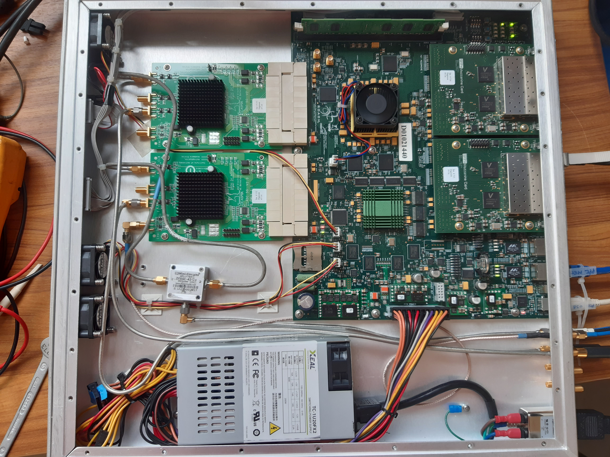

# logbook

## TODO

- adc_5g
  - Implement OGP and INL calibrtion
    - Starting with https://github.com/nrao/adc5g_devel
    - O and G are good.
    - P not so much

- In 8Ghzspectro.pdf, NOEMA:
  - uses a noise diode to calibrate ADC
    - Try that
  - Implements an overlapped PFB to get a flat RF band response

- [ ] Start differentiating select in 3 versions

- Black boxes
  - [ ] nrt_bw1800_ch16_fft_core (Issue with reset values for delay counters)
  - [ ] nrt_bw1800_2pols_ch16_8taps_pfb_core (Issue when generating IP)


- [ ] Gather fpga config, control and ADC calibration functions within a class.


- reorder firmware design files in project
- Adapt scripts to these new locations


## 2022/09/01

- adc_c9r_sst_v2
  - Modify ucf with planHead
    - shrink apodisation area to minimum
    - add more space for sefram/fft*
  - fit


## 2022/08/31

- fft_wideband_real
  - Those srl16 are really a pain.  In particular in bus_replicate where fanout is better with regs only
  - Modify /FAN/HDD2/CASPER/mlib_dev/casper_library/bus_replicate_init.m:107
  - Replace srl16 by reg-based pipeline
    ```matlab
        %reuse_block(blk, dname, 'xbsIndex_r4/Delay', ...
        %  'reg_retiming', reg_retiming, 'latency', '1', ...
        %  'Position', [xpos_tmp-del_w/2 ypos_tmp-del_d/2 xpos_tmp+del_w/2 ypos_tmp+del_d/2]);
        
        reuse_block(blk, dname, 'casper_library_delays/pipeline', ...
          'latency', '1', ...
          'Position', [xpos_tmp-del_w/2 ypos_tmp-del_d/2 xpos_tmp+del_w/2 ypos_tmp+del_d/2]);
    ```
  - Generate fft_wideband_real and nrt_bw1800_ch2048_fft_core
  - resynth_netlist('nrt_bw1800_ch2048_fft_core')
          '-register_balancing', 'yes', ...
          '-optimize_primitives', 'yes', ...
          '-read_cores', 'yes', ...
          '-max_fanout', '4', ...
  - fit failed with -2ns slack on invert in coef gen of twiddle fft
  - Set fft adder latency = 2
  - Generate fft_wideband_real and nrt_bw1800_ch2048_fft_core
  - resynth_netlist('nrt_bw1800_ch2048_fft_core')
          '-register_balancing', 'yes', ...
          '-optimize_primitives', 'yes', ...
          '-read_cores', 'yes', ...
          '-max_fanout', '4', ...
  - map failed (area too small for LUTM in sefram/fft*)


## 2022/08/30

- adc_c9r_sst_v2
  - Regenerate nrt_bw1800_ch2048_fft_core
    - not adder in DSP48
    - DSP instanciated
    - latency = 1 for all, except BRAM=2
  - resynth_netlist('nrt_bw1800_ch2048_fft_core')
          '-register_balancing', 'yes', ...
          '-optimize_primitives', 'yes', ...
          '-read_cores', 'yes', ...
          '-max_fanout', '4', ...
  - fit
  - Failing with -2ns slacks
    - Mostly in sefram/fft1/fft_wideband_real/fft_direct/butterfly1/twiddle/bus_mult*/mult*/a_replicate/din*_*/srl_delay
    - Where a simple register would do


## 2022/08/29

- mlib_dev
  - Change MAP and PAR options (xe c)
- adc_c9r_sst_v2
  - Cloned from adc_c9r_sst_v1
  - Replace 2-taps PFB for SEFRAM by apodisation
  - Backup nrt_bw1800_ch2048_fft_core
  - Regenerate nrt_bw1800_ch2048_fft_core
  - resynth_netlist('nrt_bw1800_ch2048_fft_core')
          '-register_balancing', 'yes', ...
          '-optimize_primitives', 'yes', ...
          '-read_cores', 'yes', ...
          '-max_fanout', '4', ...
  - Backup nrt_bw1800_ch64_fft_core
  - Regenerate nrt_bw1800_ch64_fft_core
  - resynth_netlist('nrt_bw1800_ch64_fft_core')
          '-register_balancing', 'yes', ...
          '-optimize_primitives', 'yes', ...
          '-read_cores', 'yes', ...
          '-max_fanout', '4', ...
  - fit failing mostly with -0.390 ns slack, in sefram FFT wide band coef gen DRAM and with -0.2 ns in channelizer FFT wide band DSP mult
  - planHead
  - Change sefram fft ch2048 to look like channelizer fft 64ch params:
    - Implementation: DSP48 adder in butterfly
    - Latency
      - BRAM 3->2
      - Convert 2->1
  - Regenerate fft 2048
  - resynth_netlist('nrt_bw1800_ch2048_fft_core')
          '-register_balancing', 'yes', ...
          '-optimize_primitives', 'yes', ...
          '-read_cores', 'yes', ...
          '-max_fanout', '4', ...
  - fit
    - Failed because fft now requires too many adders (464)
    - Restart from previous fft 2048, resynth and compile with -xe c for map and par
    - Failed with -0.4ns
  

- adc_c9r_v4.1
  - Implement channelizer module and integrate in adc_c9r_v4.1

## 2022/08/27

- adc_sst_v8
  - Failed to route
  - Regenerate fft without resynth_netlist lc off
  - Failed to route


## 2022/08/26

- adc_sst_v8
  - Negative slacks in FFT
    - Some due to large horizontal routing -> will try to cut fft in 2 (wideband and direct)
    - Some due to large fanout (was 4, reduce it to 2, regenerate fft)
  - fit
  - Same negative slacks on fanouts to multipliers
  - Regenerate 2-pols FFT with fanout=1
  - resynth_netlist
  - fit with new 2-pol FFT

- adc_sst_v7
  - From adc_c9r_sst_v1_module.py, create modules and import them into adc_sst_v7.py to test design
    - ADC_clock.py for Valon
    - ADC.py for ADC config and calibration (to be completed with OGP calibration)
    - sefram.py for win-FFT config, framer config and 1GbE config
  - Hamming window looks OK at 100 MHz
    - 

- Commit a bunch of old stuff on github and clone repo on dev servers
  

## 2022/08/25
- adc_sst_v7
  - Try generating bitmap anyway for test of win-FFT but can't generate .fpg files
  - With PlanHead, timing issue seems to come from the lack of z^-1 on PPSARMReset
  - Kill all fits to add this register (adc_c9r_sst_v1, adc_sst_v7, adc_sst_v8, adc_c9r_v4)
  - Fit OK!

- adc_sst_v8
  - Clone from adc_sst_v7
  - Replace 2 one-pol FFTs by one 2-pols FFT
  - PAR errors (old areas too small) -> remove them all -> fit 
  - Add a subsystem for ARM PPS with registered output
  - Fit
 

- Make a subsystem for ARM PPS with registered output
  - adc_c9r_sst_v1, adc_sst_v7, adc_sst_v8, adc_c9r_v4

- ADC_SST_v5.1
  - Implement I/Q ADC input selection in class ADC
  - Implement feed selection in class adc_sst_v5

- adc_c9r_sst_v1_module.py
  - Merge I/Q ADC input selection in class ADC
  - Merge feed selection in class adc_sst_v5
  

## 2022/08/24
- adc_sst_v7
  - sefram_frmr_grp area too small  ???
  - Increase again in XPS_ROACH2_base ucf and run bits
  - Tiny negative slack (-0.021ns) on 2 "independant" signals
    - Source:               adc_sst_v7_x0/frmr_c9d0a2ac35/pipeline59_9792624a6e/register0/synth_reg_inst/latency_gt_0.fd_array[1].reg_comp/fd_prim_array[0].bit_is_0.fdre_comp (FF)
    - Destination:          adc_sst_v7_x0/sefram_c2343e06f1/apodisation_x0/apodisation_c8f490b55e/pipeline62_c3afc19fce/register0/synth_reg_inst/latency_gt_0.fd_array[1].reg_comp/fd_prim_array[0].bit_is_0.fdre_comp (FF)


- adc_sst_v8
  - Clone from adc_sst_v7
  - Replace 2 one-pol FFTs by one 2-pols FFT


## 2022/08/23

- ROACH2
  - Connect Q inputs from both ADC to case connectors
  - 
  - 

- adc_sst_v7
  - Replace pfb by apodisation
    - extract_entity('nrt_bw1800_2pols_ch2048_win_hamming_core/apodisation.ngc')
    - Change ucf and update constraints from adc_c9r_sst_v1
  - fit
  - Timing violation in framer
  - Increase sefram_frmr_grp area
  

## 2022/08/23

- Create windowing block to replace SEFRAM PFB by simple apodisation
- Create 2 pols FFT for SEFRAM to compare used ressources with 2 one-pol FFTs
- Implement that into adc_sst_v7 (copy of adc_sst_v6) for tests
- Install
  - Modify /FAN/HDD2/mathworks/matlab2012b/toolbox/local/pathdef.m to remove old path from Guy installation
  - Fix /FAN/HDD2/CASPER/mlib_devel_GIT/casper_library/casper_library* files that were renamed or corrupted
  - No more flowding when generating fft
  

## 2022/08/17

- adc_c9r_sst_v1
  - Almost fitting (-2ns slack on some ~60 pathes shared by SEFRAM and Channelizer)
  - Related to counters driving the coeficient ROM adressing on both PFB (fanout of 2 for sefram, 4 for channelizer).   Their outputs always have a large fanout (16, 19?) as if they were merged and distributed over the whole PFBs.
  - Try to prevent that (force duplication of counters)
    - Backup nrt_bw1800_2pols_ch2048_2taps_pfb_core.slx as nrt_bw1800_2pols_ch2048_2taps_pfb_core_backup20220817.slx
    - Backup nrt_bw1800_2pols_ch64_4taps_pfb_core.slx as nrt_bw1800_2pols_ch64_4taps_pfb_core_backup20220817.slx
    - Add z^-1 on din and sync (16 times + reg fanout tree) for each pfb branches
  - Fit
  - Strange timing errors between SEFRAM and channelizer


## 2022/08/16

- adc_c9r_sst_v1
  - Merge loc constraints
  - Uncomment channelizer and SEFRAM
  - Fit
  - Start coding  adc_c9r_sst_v1.py + adc_c9r_sst_v1_module.py to differentiate module/classes from application


## 2022/08/15

- adc_c9r_sst_v1
  - Comment out channelizer
  - Fit SEFRAM with proper loc constraints
  - Almost fitting (slack = -0.124ns / -0.045ns on TS_mac_rx_clk)


## 2022/08/14

- adc_c9r_sst_v1
  - Fit with pfb 4 taps
  - timing issues
  - Try resynth_netlist('nrt_bw1800_2pols_ch64_4taps_pfb_core','-lc', 'off')
  - Almost fitting (slack = -0.034ns)


## 2022/08/13

- adc_c9r_sst_v1
  - Fit with only channelizer does not converge
  - Create smaller PFBs to get something to test...
    - nrt_bw1800_2pols_ch64_4tap_pfb_core
      - extract_entity('nrt_bw1800_2pols_ch64_4taps_pfb_core/nrt_bw1800_2pols_ch64_4taps_pfb_core.ngc')
    - nrt_bw1800_2pols_ch2048_1tap_pfb_core
      - 1 tap is not allowded.  See if windowing exists, or make it.

- Meantime, looking into nrt_bw1800_2pols_ch64_8tap_pfb with PlanAhead schematic, it seems that a lot of SRL16 are still around...


## 2022/08/05

- adc_c9r_sst_v1
  - Wrong behavior during fit even on the channelizer only.
  - Trash project directory and recompile -> better (slack = -3ns)
  - Use PlanHead to create pblocs (physical constraints) for pfb, fft0-1, rescale, select.
- ADC5G
  - From the docs:
    - [Schematics](https://casper.astro.berkeley.edu/wiki/images/d/d2/Schematic_ADC_A2_5G_DMUX11.pdf), [Schematic_ADC_A2_5G_DMUX11.pdf](doc/Schematic_ADC_A2_5G_DMUX11.pdf)
    - [ADC datasheet](doc/Ev8aq160.pdf)
  - We are currently using board inputs I (ADC inputs A) on the 2 ADC5G ADC boards.
  - We could use board inputs Q (ADC inputs C) for the other feed, removing the need for a switch matrix from 2 ffeds to one ADC input.
  - The ADC chip should be configured to use the other input
    - CONTROL_REGISTER (@0x01), ADCMODE[3:0]
      - 1000: One-channel mode (channel A, 5 Gsps), ADC board input I
      - 1010: One-channel mode (channel C, 5 Gsps), ADC board input Q
  - Using the python lib:
```python
adcmode = {'I': b1000,
           'Q': b1010}
adc5g.spi.set_spi_control(roach, zdok_n, adcmode=adcmode['I'])
adc5g.spi.set_spi_control(roach, zdok_n, adcmode=adcmode['Q'])
```


## 2022/08/04

- adc_c9r_sst_v1
  - Commenting out SEFRAM to try to fit channelizer first in one side of the FPGA
  - Remove all constraints on channelizer


## 2022/08/03

- adc_c9r_sst_v1
  - change par option to -xe c
- Still failing PAR (congestioned design, will not route)


## 2022/08/02

- adc_c9r_sst_v1
  - Tune SLICE REGION LOC constraints.


## 2022/07/06

- adc_c9r_sst_v1
  - Change CLOCKREGION LOC constrints for SLICE for finer grain LOC constraints.
  - Worse... 7ns slack
  - Checking with planAHead


## 2022/05/25

- adc_c9r_sst_v1
  - Change ADC sampling rate to 3700 MHz
  - Move registers into sefram and channelizer to include them in region constraints
  - Fit


## 2022/05/24

- adc_sst_v6
  - Fix ucf.
  - Can fit with 3700 MHz samling rate

## 2022/05/19

- adc_sst_v6
  - Trying to reach 3700 MHz samling rate to eliminate the need for a low pass filter on the BF feed.


## 2022/05/04

- Try to reduce the size of AREA_GROUP for channelizer_grp, but getting too small to fit ressources
- Restore original values
- Replace SLR16 in TenGbE0/led_out by 2 registers
- Recompile within XPS
- Look at c9r_16x112_v0 to reintroduce upgrades from adc_c9r_sst_v1
  - nrt_bw1800_2pols_ch16_8taps_pfb_core.slx -> error when creating blocs
    - Issue with delays being equal to 0 -> BRAM delays of depth 0 -> mannually remove the delay blocks -> SysGen complete fine now
  - nrt_bw1800_ch16_fft_core.slx -> error when creating blocs
    - Can't find something as easy as the pfb_fir.
    - Should try basic parallel fft?


## 2022/05/02

- adc_c9r_sst_v1
  - Bring all INST "adc_c9r_sst_v1_adc?_asiaa_adc5g/*" to AREA_GROUP = "ZDOK_?_ALL";
  - Only 35 violations \> -0.317ns on adc0_clk within sefram/fft and channelizer/pfb
  - Back to planAHead to fix this


## 2022/04/28

- adc_c9r_sst_v1
  - After new AREA_GROUPs (separates pfb, ffts, accs and framers)
  - Timing violations
    - adc1_clk:
      - 19 violations > 0.8ns
      - all related to "adc_c9r_sst_v1_adc1_asiaa_adc5g/adc_c9r_sst_v1_adc1_asiaa_adc5g/data*"
    - adc0_clk:
      - 104 violations
        - \> -3.7 ns (85% routing)
          - tengbe0/ten_gbe_v2  (snap and debug)
        - \> -0.969 ns (85% routing)
          - sefram, select_4f64, adc_c9r_sst_v1_x0/frmr/power_vacc1/optimized_bram_vacc1/adder  (distributed everywhere)
  - Reduce fan out on ADC outputs feeding sefram and channelizer
  - Remove snapshots from 10G
  - Remove mux from FFT outputs (used for debug a long time ago)
  - Add rescale and select_4f64 to AREA_GROUP


## 2022/04/26

- adc_c9r_sst_v1
  - After new AREA_GROUPs
  - Timing violations
    - adc1_clk:
      - 17 violations (> -0.9 ns)
      - all related to "adc_c9r_sst_v1_adc1_asiaa_adc5g/adc_c9r_sst_v1_adc1_asiaa_adc5g/data*"
    - adc0_clk: 360 violations
      - \> -1.7 ns
        - sefram/fft0/fft_wideband_real
        - sefram/pfb_fir/.../last_tap
        - Large routing delays -> AREA_GROUP per fft[01], pfb
      - \> -1 ns
        - channelizer/fft1/fft_wideband_real
        - Large routing delays -> AREA_GROUP per fft[01], pfb
      - fft_shift reg -> replicate registers to reduce fan-out
    - mac_mac_rx_cl: 2 violations
      - adc_c9r_sst_v1_OneGbE_one_GbE RAMB36_X6Y35 -> TEMAC_X0Y1
      - AREA_GROUP?
  - Inspect design with PlanAHead


- Point filtres feeds
  - À 1850MHz, le signal disparait
    - En choisissant une Fe/2 à 1820 MHz, on optimise le repliement.
  - Gabriel regarde pour construire des paires de filtres pour le feed HF pour différentes Fe:
    - 3.2 GHz: 1.65-3.15 GHz à -1dB, -30dB sous 1.55 GHz et au dessus de 3.25 GHz
    - 3.4 GHz: 1.75-3.35 GHz à -1dB, -30dB sous 1.65 GHz et au dessus de 3.45 GHz
    - 3.6 GHz: 1.85-3.55 GHz à -1dB, -30dB sous 1.75 GHz et au dessus de 3.65 GHz


## 2022/04/25

- adc_c9r_sst_v1 still fitting after ~20h...
- Fix all select_*f*
  - D-latched word in Register3 should be assigned to MSB (in1) of bus_create
  - select_8f64_sim.slx
  - select_8chan_sim.slx
  - select_4f64_sim.slx
  - adc_c9r_v0.slx
  - adc_c9r_v1.slx
  - adc_c9r_v2.slx
  - adc_c9r_v3.slx -> Already fixed
  - adc_c9r_v4.slx -> Already fixed
- select_1f16
  - select_1f16: select 1 chan from 16x112MHz (for high-z HI observations)
  - Start design from select_8f64_sim.slx
  - Remove chans 1, 2, 3
  - Simulation looks good
- c9r_16x112_v0:
  - Start from adc_c9r_sst_v1.slx, commenting sst (SEFRAM)
  - Implements 2 instances of select_1f16 to feed 2 10G.
  - Generate blackbox using memo ["Optimize CASPER Development by “Black Boxing” Designs"](./doc/Black_box_memo.pdf)
    - nrt_bw1800_ch16_fft_core.slx
      - System Generator, Generate
        - Issue with reset values for delay counters
    - nrt_bw1800_2pols_ch16_8taps_pfb_core.slx
      - System Generator, Generate
        - Issue at generation.  Will try later
- adc_c9r_sst_v1 still fitting after >24h...
  - Kill process
  - Extend AREA_GROUPs (X0Y0-X1Y4 + X0Y5-X1Y8)
  - Restart casper_XPS
  - Error in synth: */frmr_*/pcktizer* -> */frmr_*/pckt*
  - Restart casper_XPS


## 2022/04/23-24

- Back to adc_c9r_sst_v1
  - Compile with empty ucf file (no AREA_GROUP constraints)
  - Use tuto Spectro_NRT/ROACH2_system_description/annexe_B.pdf to start PlanAHead
    - FPGA Clock region ressources
      - 9x2 regions
      - DSP48E1 / regions: 112
    - Channelizer
      - pfb: 256 MULT
      - fft: 320+320 MULT
      - 8 Clock regions required for MULT
        - X0Y0-X1Y3
    - SEFRAM
      - pfb: 64 MULT
      - fft: 224+224 MULT
      - vacc: 64 MULT
      -  5.2 Clock regions required for MULT
        - X0Y6-X1Y8


## 2022/04/21

- Install LF feed equivalent noise setup in computer room:
  - NoiseCom 2-4 GHz with 7 dB attenuation (instead of 15 dB to compensate for losses in splitter)
  - TTI TGR6000 with 1420 MHz, 50 mV sine
  - Band pass filter : micro-tronics BPC12740
  - Diagram below
  - LF feed system noise is ~20dB over ADC noise floor -> OK
  - From the ADC input dynamic range, we would like a little bit more of power, even if that would bring more range issue with RFI (Would it???).  **No large amplification is required**.
  - After a circulator, the level would be only 10dB over ADC noise floor.  Good for test, but probably short for actual observations.
  - A low pass with 1.8GHz cut-off frequency may not be absolutely usefull
    - This has to be tested with the actual feed since it seems to have sharper edges.
    - To increase the guard band, could we slightly increase the Fs?  2x 1.85 GHz?  2x 1.9 GHz?
  


- Extrapolation for HF feed
  - We do not have, yet, filters to mimic or to condition the band for sampling.
  - Since the band is wider, we can expect a larger V_RMS noise and the noise density on this feed looks a bit higher, leading to better feed noise to ADC noise ratio.
  - This has to be confirmed anyways, but **no large amplification is required**.


## 2022/04/19

### Measurements of RF bands of LF and HF NRT feeds

#### Feed BF
##### Direct


##### Circulateur


#### Feed HF
##### Direct


### Setup to mimic Feed Frequency responses
#### BF before circulator

- NoiseCom 2-4 GHz generator with 15-16 dB attenuation provides the right noise power density (-56dBm/-58dBm) in the HF band, but the band is too wide (1-5GHz at -10dBc)
  - Need for additionnal:
    - Sharp low pass at 1.8-1.9 GHz
    - Sharp high pass at 1.2 GHz

- The NoiseCom 6110, 1500 MHz, provides a similar PSD with 33dB attenuation.
  - Need for additionnal:
    -  Sharp high pass at 1.2 GHz


#### BF after circulator

The circulator provides an extra 10 dB power drop in the band of the LF feed.


#### HF

- NoiseCom 2-4 GHz generator with 12-13 dB attenuation provides the right noise power density (-52dBm/-53dBm) in the HF band, but the band is too wide (1-5GHz at -10dBc)
  - Need for additionnal:
    - Low pass at 3.6 GHz
    - High pass at 1.4 GHz


#### Available filters

- micro-tronics BPC12740
  - 1.23-1.8GHz -> pertes d'insertion: -2 dB
  - 0-1.16 + 1.848-6.69 ->  réjection > 50dB
  - remontée entre 6.7 et 8GHz (< -20dB)
  - Perfect to mimic LF Feed with NoiseCom 2-4GHz with -15dB

- K&L 5B121-2100/T1250-0/0
  - Probably 2100 ± 1250/2 MHz
  - 1.6-2.6 GHz (bande passante à -3 dB)

- K&L 6B120-1666/150-0/0
  - 1.6-1.7 GHz à -3 dB

- K&L 5B120-1350/U210-0/0
  - 1.22-1.47 GHz -3 dB

- K&L 6B120-3375/350-0/0
  - 3.2-3.5 GHz à -3dB


#### Setup

##### LF feed

- NoiseCom 2-4 GHz with 15 dB attenuation
- micro-tronics BPC12740

- FSH8
  - Spectrum:
    - -58 dBm with 3-MHz RBW within 1.2-1.8GHz
      - Conversion with https://www.harald-rosenfeldt.de/2018/08/19/measuring-rf-noise-with-an-rf-spectrum-analyzer-or-how-to-convert-dbm-into-v-sqrthz/
        - noise density: n[V/sqrt(Hz)] = sqrt(R * 0.001 * 10 ** (PdBm/10) / RBW_Hz) = sqrt(50*0.001*10**(-58/10)/3e6)
        - PkPk = 6.6 * n * sqrt(BW_Hz) = sqrt(50*0.001*10**(-58/10)/3e6)*6.6*sqrt(600e6) = 26 mV
      - 
  - Power meter:
    - Fc=1.5GHz, Ch BW=0.9MHz, P = 8.7dB
    - Fc=1.5GHz, Ch BW=0.6MHz, P = 7.7dB
    - Fc=1.5GHz, Ch BW=0.3MHz, P = 4.7dB
    - Measurements probably incorrect -> redo after zeroing the device

- LeCroy WaveRunner 640Zi
  - Vrms: 1 mV
  - Pkpk: 10 mV -> agree with PkPk from Spectrum?


## 2022/04/08

- Found bug in adc_sst_v5.1.py leading to data losses on SEFRAM stream
  - Fixed.


## 2022/04/07

- NRT Backend meeting


## 2022/04/06

- adc_c9r_sst_v1
  - Design Summary:
    - Number of Slice Registers:               210,668 out of 595,200   35%
    - Number of Slice LUTs:                    157,370 out of 297,600   52%
    - Number of RAMB36E1/FIFO36E1s:                187 out of   1,064   17%
    - Number of RAMB18E1/FIFO18E1s:                489 out of   2,128   22%
    - Number of DSP48E1s:                        1,477 out of   2,016   73%
  - PAR:
    - Slack = -8.471 ns (7.2% logic, 92.8% route)
    - But no AREA_GROUP
  - Open PlanAHead to investigate
  

## 2022/04/05

- adc_c9r_sst_v1
  - The router has detected a very dense, congested design.
  - Replace nrt_bw1800_2pols_ch64_16taps_pfb_core by 8taps
  - Compile


## 2022/04/04

- adc_c9r_sst_v1
  - Starting new design that merges
    - adc_c9r_v3
      - nrt_bw1800_2pols_ch64_16taps_pfb_core
      - rescale
      - select_4f64
      - 10G framer
    - adc_sst_v5 SEFRAMer
      - nrt_bw1800_2pols_ch2048_2taps_pfb_core
      - *_vacc
      - packetizer
      - One_GbE
  - Compile
  - Compile interrupted by Ctrl-C used to copy/paste Device Utilization Summary.
  - Clean up compile processes:
    - killall matlab_helper sysgensockgui sysgensockgui.bin TclProxyServer TclProxyServer.bin MATLAB java xilperl saferun saferun.bin xst xlicmgr _cg dspcache.bin par xflow trce
  - Restart compile...
  - Device Utilization Summary:
    - Number of Slice Registers:               220,358 out of 595,200   37%
    - Number of Slice LUTs:                    167,304 out of 297,600   56%
    - Number of RAMB36E1/FIFO36E1s:                187 out of   1,064   17%
    - Number of RAMB18E1/FIFO18E1s:                489 out of   2,128   22%
    - Number of DSP48E1s:                        1,733 out of   2,016   85%
  - Strange that adc_c9r_sst_v1 RAMB18E1 usage is lower than (adc_sst_v5 + adc_c9r_v4) RAMB18E1 usage
  - Acronym generator
    - www.dcode.fr/acronym-generator
    - General Purpose Nançay Decimeter Radio Telescope Channelizer and SEFRAM  ?


## 2022/04/03

- Several compiles failed beaause of large routing delays
- Successfull after smaller AREA_GROUP
  - AREA_GROUP "PFB_grp" RANGE=CLOCKREGION_X0Y5:CLOCKREGION_X1Y7;
  - AREA_GROUP "FFT0_grp" RANGE=CLOCKREGION_X0Y3:CLOCKREGION_X0Y5;
  - AREA_GROUP "FFT1_grp" RANGE=CLOCKREGION_X1Y3:CLOCKREGION_X1Y5;
  - AREA_GROUP "VACC_grp" RANGE=CLOCKREGION_X0Y2:CLOCKREGION_X0Y3;
  - Check how small they could be to prepare merging adc_sst_v5 + adc_c9r_v3 into adc_c9r_sst_v1


## 2022/03/31

- adc_sst_v5
  - Reimplement adc_sst_v4, but with more hierarchies in the DSP chain to easy merge designs
  - Timing error during fit:
    - /FAN/HDD2/cedric/NRT_spectro/adc_sst_v5/XPS_ROACH2_base/implementation/system.twr
    - For fft0 and fft1 (20% logic, 80% route)
  - Add AREA_GROUP constraint in adc_sst_v5.ucf
    - But doesn't find */SEFRAM/* in design -> it's */SEFRAM_*/* because a SHA-1 is appended to the name of the entities
  - Compile...
  - Device Utilization Summary:
    - Number of Slice Registers:               129,494 out of 595,200   21%
    - Number of Slice LUTs:                     95,454 out of 297,600   32%
    - Number of RAMB36E1/FIFO36E1s:                 83 out of   1,064    7%
    - Number of RAMB18E1/FIFO18E1s:                160 out of   2,128    7%
    - Number of DSP48E1s:                          578 out of   2,016   28%

  

## 2022/03/26

- adc_c9r_v4 with nrt_bw1800_2pols_ch64_16taps_pfb_core
  - Same timing error (75% route) between rom and DSP
  - Slice Logic Utilization:
    Number of Slice Registers:               104,303 out of 595,200   17%
    Number of Slice LUTs:                     77,432 out of 297,600   26%
    Number of RAMB36E1/FIFO36E1s:                112 out of   1,064   10%
    Number of RAMB18E1/FIFO18E1s:                585 out of   2,128   27%
    Number of DSP48E1s:                        1,157 out of   2,016   57%
  - Try "Used distributed memory for Coefs" in pfb
  - Comile OK in 2h
  - Next time could try:
    -  CLOCKREGION_X0Y5:CLOCKREGION_X1Y7 is too big now
    - Try resizing it back to pre area, but not overlapping with FFT:
      - i.e: CLOCKREGION_X0Y6:CLOCKREGION_X1Y7
  - Measure new PFB chan rejection
    - 
    - Transition band is narrower, as expected.
    - Is it worth the FPGA ressources?

- adc_sst_v4
  - adc_sst_v4 is still working with its associated config script
  - Scan the band from 10 to 1800 MHz to illustrate the 2048-chan 2-tap PFB response
    - 
  

## 2022/03/25

- Redo better data capture and nicer plots for PFB rejection measurements:
  - 
  - 
  - 
- adc_c9r_v3_2022_Mar_24_1150 could be the first production-ready
  - Slice Logic Utilization:
    Number of Slice Registers:                94,735 out of 595,200   15%
    Number of Slice LUTs:                     70,173 out of 297,600   23%
    Number of RAMB36E1/FIFO36E1s:                112 out of   1,064   10%
    Number of RAMB18E1/FIFO18E1s:                329 out of   2,128   15%
    Number of DSP48E1s:                          901 out of   2,016   44%
- Testing other windows and tap length to reach narrower transition band with same rejection.
  - Hamming with 16 taps looks good.
  - Testing synthesis with such params
  - PFB IP generation takes forever.  Frozen?
  - Restart IP generation with 12 taps only.
    - Stuck again.  Lots of dead processes from XST and simulink -> clean all
  - Restart IP generation with 12 taps only.
    - OK
  - Restart IP generation with 16 taps.
    - OK
  - extract_entity('nrt_bw1800_2pols_ch64_12taps_pfb_core/nrt_bw1800_2pols_ch64_12taps_pfb_core.ngc')
  - extract_entity('nrt_bw1800_2pols_ch64_16taps_pfb_core/nrt_bw1800_2pols_ch64_16taps_pfb_core.ngc')
  - Create adc_c9r_v4 with nrt_bw1800_2pols_ch64_16taps_pfb_core
    - Compile
    - Region CLOCKREGION_X0Y5:CLOCKREGION_X1Y6 too small for PFB
    - Increase to CLOCKREGION_X0Y5:CLOCKREGION_X1Y7
    - Timing error (75% route)
    - resynth_netlist('nrt_bw1800_2pols_ch64_16taps_pfb_core','-lc', 'off')
    - resynth_netlist('nrt_bw1800_2pols_ch64_12taps_pfb_core','-lc', 'off')
    - Compile


## 2022/03/24

- Looking at raw data received on copper5.  Could they be read in a wrong way?
- The odd and even samples are swapped in the packets, leading to ghost line and strange pfb gain response
  - On 64-bit words, 2 samples (8bits, Re/Im, polX/Y = 32 bits) are packed.
  - I choose to put the first sample on the LSB part of the bus -> wrong choice
- Fixed in adc_c9r_v3/select_4f64
  - D-latched word is assigned to MSB now.
  - Recompile
- Checking PFB theoretical rejection
  - 
  - 
  - 
  - 
  - Looks OK.   Still some harmoncs -> need ADC calibration (not yet performed here)
- Deploy new firmware adc_c9r_v3_2022_Mar_24_1150 with sample swap removed.  Remove patches from recording and plotting scripts.
- Looks OK at first glance, now.


## 2022/03/22

- Tests of sine across the band.
  - Strange freq response within a channel:
    - presence of a second line
    - and amplitude is changing a lot across the channel
- Back to simulation of pfb_fir + fft_wideband_real
  - pfb_fir is rotten (**EDIT (2022/03/25): Dirac generated in simulation turned out to be at the wrong time with respect to SYNC**)
    - Impulse response looks bad 
  - Regenerating pfb and test benches
    - Expected:
      - 
      - 
    - pfb_fir_64ch_sim.slx
      - Looks good with default latency params (but 128 chans and 8 taps)
    - channelizer_64ch_sim.slx
      - Looks good with default latency params (but 128 chans and 8 taps)
      - Looks good with original pfb generated for adc_c9r_v3.slx
    - Observed:
      - 
- Regenerate nrt_bw1800_2pols_ch64_8taps_pfb_core with no optimisation
- Recompile adc_c9r_v3.slx
- Check what happens with generator on ADC0 only
  - Everything looks good (except image lines and bandpass response) when swapping channels and forcing one of them at 0.


## 2022/03/21

- TGR6000 can be controlled from cedric-HP-ZBook-15-G2 server now.
- The PFB channel outputs look great now.  It this beacause of the faulty USB connections?
  - 
  - 
- Calibration methods nrao_adc5g_cal and nrao_adc5g_cal give similar results for Offset and Gain, but delays seems opposite...
  - Will try to cal O et G first and then Delays.
  - Delays are opposite dur to fit model -> fixed.  But delay calibrations are quite inconsistent (large variance estimation and when used, do not look great)
  

## 2022/03/19

- Setting up TGR6000 frequency generato to work with VISA
  - Requires python 3.6+
  ```pip install pyvisa
  import pyvisa as visa
  visa.__version__  ->  '1.11.3'
  rm = visa.ResourceManager()
  inst = rm.open_resource("TCPIP0::192.168.1.100::9221::SOCKET", read_termination='\n', write_termination='\n')
  inst.query("*IDN?")
  inst.write('freq 21.12345')
  inst.write('MVLEV 10')
  ```
  - ERROR in doc: freq is MHZ, not HZ


## 2022/03/17

- USB ports on cedric-HP-ZBook-15-G2 server used to control the ROACH2 were forcing a reset on the PPC uboot.
- Rebbot of server was enough to fix 
  > Hi CASPER members,
  > 
  > It turned out that the controlling server had a funny issue with its USB port drivers.
  > 
  > It was usable with some other USB-Serial hardware but, somehow, when the USB cable was connected on the ROACH USB port, it was freezing back uboot at startup.
  > And since I was using minicom to monitor the boot up of this roach, well...
  > 
  > After a fresh server start, I got the system up and running again. 

- Found thanks to a spare ROACH2 lent by Guy
- Back in computer room
- DHCP server not starting on cedric-HP-ZBook-15-G2 server
  - sudo /etc/init.d/dnsmasq restart
- Full test


## 2022/03/15

- Add udev rules in /etc/udev/rules.d/99-usb-serial.rules to always provide access to Valon here: /dev/ttyUSB_valon
- ROACH2 seems bricked...
  - Can't boot, ping, or minicom the PPC uBoot
  - Asked for help on Slack and mailing list
    > I've been using a ROACH2 unit for some time now and since yesterday I can't connect, ping or reboot it properly.
    > 
    > I've started digging a bit in the mailing list to find fixes, without success:
    > - Power Led is on.
    > - Power supply starts.
    > - USB OK, AUX and CPLD leds are ON.
    > - CPU_RDY, CPU_ERR, PPC_ERR are OFF.
    > - The reset/Fault led used to be ON randomly, without any issue on the system.  It's permanently ON now
    > - I used to see CPU ready and/or Error LEDs ON sometimes (can't remember...), but now it's always off, both.
    > - The original iStar/Xeal power supply was replaced this morning by an other power supply -> same behavior
    > - C163 looks good.
    > - When the board is powered, all 4 ttyUSB peripherals show up, but stay quiet.
    > - minicom on ttyUSB2 with correct serial config shows nothing
    >   - I once got a fragment of what could be the uboot prompt (...at 533.333 MHz...)
    > 
    > I haven't tried yet to:
    > - remove the 2 ADC5G and the 2 SFP+ mezzanine boards
    > - scan the JTAG chain
    > - use the RS232 connector
    > But is this usefull?
    > 
    > Any ideas or test I could try to restore the functionalities of this board, please? 


## 2022/03/11

- PFB+FFT simulation
  - Same image but at a different frequency (34.275 rather than ~35.5)
  - But found wrong config for PFB (2^12 chan instead of 2^7)
  - Resimulation
- Fighting with TTI TGR6000 VXI...
  - Trying python-vxi, pyvisa, ...


## 2022/03/10

- Changing AgilentE8257D for a TTI (generator required for NRT)


## 2022/03/09

- Simulating PFB+FFT on a 21.9726 sine


## 2022/03/08

- Add RJ45 to AgilentE8257D for remote control
  - http://192.168.40.100
  - install https://pypi.org/project/RxLab-Instruments/
- Create nrt_bw1800_2pols_ch64_8taps_biplex_pfb_core.slx
- Generate NGC over nrt_bw1800_2pols_ch64_8taps_pfb_core !!!
- Generate NGC in the right place (..._biplex_...)
- Generate NGC for nrt_bw1800_2pols_ch64_8taps_pfb_core (destroyed by mistake...)
- resynth_netlist('nrt_bw1800_2pols_ch64_8taps_pfb_core','-lc', 'off')
- resynth_netlist('nrt_bw1800_2pols_ch64_8taps_biplex_pfb_core','-lc', 'off')
- Create adc_c9r_v3 and integrate new pfb (nrt_bw1800_2pols_ch64_8taps_biplex_pfb_core)
  - casper_xps
  - Wrong signal size between pfb and fft (36 to 18 bits)
  - Revert to old nrt_bw1800_2pols_ch64_8taps_pfb_core
  - Simulation needed to understand this.
  - Synth adc_c9r_v3:
    - adc_c9r_v2 design with new nrt_bw1800_2pols_ch64_8taps_pfb_core (port0/1 reassigned) 


## 2022/03/07

- OGP calibration with https://github.com/nrao/adc5g_devel not fantastic
- Try fitting ```x[0] + x[1]*np.sin(wt[:,core_idx] + x[2])``` instead of ```p[0] +  p[1] * sin + p[2] * cos```


## 2022/02/22

- Streamer still pushing data to copper5: nice!
- Back on calibration...


## 2022/01/25

- adc_c9r_v2
  - Not better...
    - fft1 sync input not connected!  Forced to 0 but used to reset some counters in fft stages: not good...
    - Connect sync to fft1
  - Both chans behave identically now
  - But strong lines
  - Reinsert PFB
  - fit...
  - adc_c9r_v2_2022_Jan_25_1452.fpg
    - YES!
    - Two lines (18MHz and 32MHz(?)), quite good rejection elsewhere (but needs to be evaluated more precisely) 


## 2022/01/24

- adc_c9r_v2
  - Polarisation swap looks good after fft and rescaler looks ok on polarisations
  - Issue seems to be located on the IOs of the PFB FIR
    - Suppress PFB and connect directly ADCs to FFT inputs
  - Fit...


## 2022/01/23

- adc_c9r_v2
  - Pol1 is not real in chan0...
    - Injecting 0's didn't help...
    - Add possibility to feed ADC0 or ADC1 (or 0 or periodic signal) into both digital chains
    - fit...


## 2022/01/20

- Change Fin freq to 18.30 MHz
  - Should apprear at +4.2375 MHz in channel 1
- adc_c9r_v2
  - select_4f64 config: swapped nof_chan and samples_per_frames on bus -> Fixed
  - Pol1 is not real in chan0...
    - Inject 0 on output of fft to pinpoint issue...


## 2022/01/19

- adc_c9r_v0
  - Remove debug HW from design (constant injection to understant previous problems)
  - Add overflow fft flags
  - Export nof_chan+nof_samples_per_frames from select to SPEAD packetizer
  - Setup SPEAD header ItemPointers to fit nof_chan and samples_per_frames
  - When FFT or FFT1 overflow is ≠ 0, latch it.
  - Fit to get the last stable version
    - adc_c9r_v0_2022_Jan_19_1145.fpg
    - Moving to v2 (v1 had counters instead of PFB+FFT)
- select_8chan_sim
  - transfert fix from adc_c9r_v0/select into this test bench and modify input stream to get same behavior.
- select
  - select -> select_8f64:
    - select 8 chans from 64x28MHz (current as reference)
  - Trim select_8f64 to get select_4f64
    - select 4 chans from 64x28MHz (for galactic observations)
    - Add output port to forward config to SPEAD header
- adc_c9r_v2
  - Integrate select_4f64
  - fit
  - Looks good!

## 2022/01/18

- adc_c9r_v0
  - Still struggling with time closure in fft and pfb.
  - -0.617ns slack on adc5g clk
  - Will try to confine the design in the 50% in the middle of the design
    - only using:
      - 15% register
      - 22% LUTs
      - 13% RAMB36
      - 15% RAMB18
      - 43% DSP48
    - PlanAhead
      - CLOCKREGION range X0Y0:X1Y8
      - SLICE range X0Y0:X209Y359
      - restrict:
        - PFB to CLOCKREGION range X0Y5:X1Y6
        - FFT to CLOCKREGION range X0Y2:X1Y5
  - We have a fit!
  - Channels 9 and 10 contain a strong line.
    - FFT of adc snap says 42 MHz
      - Chan0 is -14.0625 to 14.0625 MHz
      - Chan1 is 14.0625-42.1875 MHz
      - Chan2 is 42.1875-70.3125 MHz
      - Chan3 is 70.3125-98.4375 MHz
    - So, the line is just between chan1 and chan2
    - So, the fft outputs are early by one sample, or sync is late by one
      - Fixed in select/channel[0..7] after 8to1-mux on datain
  - Fit again.
  - adc_c9r_v0_2022_Jan_18_2022.fpg is looking good!
    
  
## 2022/01/16

- adc_c9r_v0
  - Still struggling with time closure in fft and pfb.
  - Add z^-1 every where, but doesn't help...
  - mailing list says some thing about resynthesizing the netlists with "-lc off"
    - https://www.mail-archive.com/casper@lists.berkeley.edu/msg05588.html
    - resynth_netlist('nrt_bw1800_ch64_fft_core','-lc', 'off')
    - resynth_netlist('nrt_bw1800_2pols_ch64_8taps_pfb_core','-lc', 'off')
  - fit...


## 2022/01/15

- adc_c9r_v0
  - Still struggling with time closure in fft and pfb.
    - Affected by routing between DSP and/or DRAM (80%)
    - use adders from DSP48 adders in fft
    - Increase z^-1 on DSP and BRAM but the router should know better and don't spread ressources on all corners of the chip... :(
   


## 2022/01/09

- adc_c9r_v0
  - Difficult to get a fit for this test (3 attemps)
  - Found a bug on the input of rescale
    - Led to Re and Im to be replicated
    - Doesn't explain why one chan is not shown.
  - After fix, can't fit design anymore (slack = -1.7ns)
    - Issue in fft[01]/.../conv
      - Reduce z^-2 to z^-1 (simple adder don't need 2 clk cycles...)
  - Regenerate fft ngc
  - Fit

## 2022/01/08

- adc_c9r_v0
  - Only getting samples from pol0.
  - Add a bunch of snapshot IPs to pinpoint the problem.
  - Timing issue
  - found a label bug anyway
  - refit
  - Found how to increase par effort in mlib_dev/xps_base/XPS_ROACH2_base/etc/fast_runtime.opt


## 2022/01/07

- adc_c9r_v0
  - Test firmware
  - Write stream analysis to validate data (overflow, underflow, spectrum, ...)
  - Getting pairs of bytes strictly equals
    - Looking like Re=Im for all samples...
  - Add Muxes on ADC output and FFT output to locate issue
  - fit
  - Setting one of the ADC inputs to 0 doesn't change the channel!
    - Keep checking...

## 2022/01/06

- adc_c9r_v0
  - nrt_bw1800_2pols_ch2048_8taps_pfb_core
    - Timing violation
    - Set z^-2 on multipliers to ease timing between bram used as delays and mults
    - Fit is OK
  - Add "Swap 32-bit words on the 64-bit bus" on the output databus of select because counters go as 1,0,3,2,5,4,7,6
- Discussions with Ismaël Cognard
  - 64x28MHz channels are good for Galactic observations -> keep developping that design
    - 4 channels at most seem sufficient
    - Would be nice to distribute channels as UDP packets addressed to different ports
  - But for extra galactic observations, we need wider channels (32x56 or 16x112 MHz)
    - Will make a design for 16x112MHz chans.  With 2 10G interfaces, 1 chan each.


## 2022/01/05

- Bug in valid from select (1 clk too long)
- Ready not generated correctly (only once instead of for each packet)
- Fix, sim and fit
- Frames look ok now.
  - Endians are probably not the best choice.
  - Some fields are useless in header
  - See with Ismaël about that.
- adc_c9r_v0
  - Reinsert select module
  - Generate pcore for 8-tap PFB (nrt_bw1800_2pols_ch2048_8taps_pfb_core)
  - Generate pcore for FFT (nrt_bw1800_ch64_fft_core)
    - Error:
      - coeff_gen simulink Initialization commands cannot be evaluated.
      - Caused by: Library must be saved before creating new library links
    - Start over with nrt_bw1800_ch2048_fft_core and modify nfft
  - Integrate pcore to adc_c9r_v0


## 2022/01/04

- Framer gets stuck.
  - select_chan0_status = 4
  - TenGbE1_tx_afull = 1
  - TenGbE1_tx_overflow = 1
  - Not much information -> need to go back to easier things
- Upgrade roach2_tut_tge.[slx|py]
  - Sends packets with different sizes and periods
  - MTU was 1500 on copper, so frames > ~1500 were dropped by NIC
- Sets copper5 MTU to 9000
  - sudo ip link set mtu 9000 10GB02
- Framer sends one 8256B frame and gets stuck.
  - Confirmed in simulation: the configuration of the SPEAD framer makes eof pulses at the wrong spot


## 2022/01/03

- Connect a HP E4420B as a source signal instead of a Valon clock 2.
  - Better, less harmonics
    - Provide some plots
  - Still a "strong" line at Fs/4 (same level as DC and NY)
  - Strange saw tooth pattern on a 10MHz sine
    - Interleaved ADC calibration?
      - Yes.  After MMCM calibration, it's required to perform OGP and INL calibration
      - See https://github.com/nrao/adc5g_devel
- Connect 10G from slot 0 port 0 to Copper5 to test select, SPEAD framer and 10G configuration


## 2022/01/02

- Mixup between number of samples and number of words (2 samples / words)
- It take almost half the time required to buffer data to export them.
  - So plenty of time...
  - Checking frames now, and generating data_valid and ready 
- Fit a design with ADC, select, SPEAD framer and 10G


## 2022/01/01

- Seems to wokr with 7 channels.
  - The 8th one doen't seem to have enough time to get exported -> to be checked.


## 2021/12/29

- Single channel buffer seems to work.
  - Buffers samples packed by 2 (2 x 2 samples x 2 pols x 2 ReIm) for the selected channel
  - Reads-out with simple re signal
  - Can't parametrise because Xilinx FIFO depth are configured from drop-box menu
- Start implementing 8 chans in project select_8chan_sim


## 2021/12/19

- Thoughts about payload filling
  - 10G units will use SPEAD packet format and 1024 64-bit words of payload.  Fitting a jumboframe < 9000 bytes
  - We output int8 complex polarized data samples, leading to 32-bits data sample, 2 data samples per words.
  - When outputing 5, 6, 7, 8 channels:  256 samples per packet
  - When outputing       3, 4 channels:  512 samples per packet
  - When outputing          2 channels: 1024 samples per packet
  - When outputing          1 channel : 2048 samples per packet
  - WHen receiving 8 blocks, we got 8x8 = 64 channels


## 2021/12/17

- Framer looks good!
- Keep adc_sst_v4 as reference.
- Start adc_c9r_v0 design
  - adc_channelizer_v0
  - ADC, PFB (2taps, 128chan), FFT 128 chan
  - 64 chans of 28.125MHz
  - Select 8 chans out of 64 to feed a 10G link


## 2021/12/16

- Extract pulse_extender from power_vacc and crosspower_vacc to reuse it between all blocks
- Bug fixed on the 2021/12/11 restored somehow...
  - Fix again and resynth
- But that was not the right bug...
  - Dataframe is now of the right size
  - But channels are off by 8 channels (1 FFT frame sample) 
  - Fix, and synth


## 2021/12/15

- For several days, timing closure issues on the design...
- In power_vacc and crosspower_vacc, could merge all pulse extenders into a single one distributed to all vacc.


## 2021/12/11
 
- Frames look good.  But late by 8 channels
- Confirmed in sim, fixed, resynth


## 2021/12/11

- Found bug in dump address condition
- Fix in sim, running synth
- Looks ok -> integrate it into adc_sst_v4 and synth


## 2021/12/10

- vacc_packetizer_sim
  - HW looks ok.
  - recording is fine, but counters are stuck to 0xfe


## 2021/12/08

- vacc_packetizer_sim
  - Add "chunk" support to export the vacc data as 16 4kb frames
  - Make a test design with counters as data to check framer and one_GbE
  - Sim is ok, running synth


## 2021/12/01-07

- adc_sst_v3:
  - Timing issues with vacc, power and cross power
    - Play with PlanHead with not much success
    - Insert reg before adder in vacc-> improvement
    - Add pipeline (1->2) to power/crosspower mults
    - Still some issue with pfb_2taps/pfb_fir/pol1_in1/rom1
  - Timing are ok now.  Can test 1GbE.
- one_gbe_ref_design
  - Connect a frame generator to a 1GbE IP to check unit.
  - After several adjustments in the frame generator, can receive data on nanunib (wireshark)
    - (IFG, frm_len) = (220000000, 128)  -> OK
    - but breaks for frm_len > 8192
    - Need to modify framer to split the (32 + 256*8*4*8) bytes frame into 16 frames


## 2021/11/25

- Moved the ROACH2 and all subsystems to CDV's office for HW tests
- Realized that LVDS bus sampling clock is referenced to ZDOK_ADC0 input and that that ADC clock for ADC1 has to be skewed from ADC0
- In fact, both ADC LVDS buses need to be adjusted with respect to the FPGA serdes clock
- Found some code here: https://github.com/Smithsonian/adc_tests
- Forked here for backup: https://github.com/CedricDViou/adc_tests
- mdl file couldn't be compiles (.so missing error...)
- But code adjust the mmcm PLL phase
- Run it in a loop for the 56 possibilities and write down the edges of the eye
- Both spectrae are now the same and the noise floor is FPGA limited (fixed point FFT)
  - 
  - 


## 2021/11/23

- adc_sst_v3_2021_Nov_23_0941.fpg
  - Fixed new_acc generation
    - Get im=0 at DC
  - Vacc dumped from BRAM is good now (no chan offset anymore)
  - Vacc dumped from snapshot is delayed by 8 samples (1 clk cycle) -> fixed
  - recompile
- adc_sst_v3_2021_Nov_23_1226.fpg
  - Vacc dumped from snapshot is good now (no chan offset anymore)
  - move on to next functionalities
  - Check this noise level


## 2021/11/22

- adc_sst_v3
  - Accumulated frames not showing im=0 for DC -> wrong framer
  - Replace blackbox by their simulink models (long...)
  - try to simulate

## 2021/11/20

- adc_sst_v3
  - Add BRAM vacc buffers
  - FFT shift was not strong enough
    - Better with 0xaaf regarding lines, but could be too strong for noise -> to be adjusted
  - ADC noise on chan0 is too strong wrt ADC1
    - Check HW
  - Disentangle vacc_snapshots and vacc_BRAM correctly
    - but residual latency needs to be fixed
      - 2x8 for BRAM
      - 3x8 for snapshot
    - Add
      - z^-2 on output of FFT (cmmon to BRAM and snapshot)
      - z^-1 on snapshot datapath
  - recompile

## 2021/11/18-19

- adc_sst_v3
  - Trying to disentangle FFT output channels
    - Wrong reordering in Vacc (already done in FFT -> output in natural order)
    - Wrong signal used to restart accumulation (new_acc instead of fft_sync)
  - use python code from snap_adc5g_feng_rpi to read vacc snapshot units
  - recompile
  - Wrong signal used to restart accumulation (new_acc instead of fft_sync)
    - No, it was ok.
    - Simulate this part to understand why the chans are not right

## 2021/11/15

- adc_sst_v3
  - Lost in the way...
  - Add fft_out_pwr[01]_0to7 that are computation of instantenous power of fft_out[01]_0to7 for debug.
  - recompile
  - instantenous powers fft_out_pwr[01]_0to7 look good.
  - But vacc_ss snapshot blocs are full of zeros...
  - Reduce snapshot depth to 2^8 (was 2^9)
  - recompile

## 2021/10/15

- adc_sst_v3
  - vacc outputs truncated to 8 bits (should be 64...)
  - recompile

## 2021/10/14

- adc_sst_v2
  - Can get snapshots of complex waveforms on the output of the 8 lanes of the 2 fft modules and could reformat them for plotting
  - 256-sample periodic patterns -> OK with a 2048-sample FFT on 8 lanes.
  - But the VACC was setup for 128-sample patterns -> fix adc_sst_v3 and start a new fit

## 2021/09/26

- adc_sst_v2
  - Fits properly
  - ADC at 3.6 GEch/s with snapshots
  - PFB 2 taps (for quick fit...)
  - FFT real 2048 chans with snapshots
  - Auto and cross correlation
    - acc_len
    - snapshots on either XX/YY or XY
    - Ready to be replaced by 1GbE framer
  - TODO:
    - Tests fft_shift, acc_len, ...
- Create adc_sst_v3 for backup
  - Will probably include 1GbE framer
  

## 2021/09/25

- New latency in PFB and FFT to ease timing closure
- adc_sst_v1 fit properly (design is only ADC, PFB and FFT with snapshot modules)
- Starts adc_sst_v2 to add auto and cross power estimators
  - Did it with matlab 2013b, but issues during compile -> restart from scratch with 2012b


## 2021/09/23

- After testing with several DAC/AOP cables, 10G switch and 10G NIC of COPPER5:
  - nanunib NIC is not working (link always down)
  - ROACH is streaming data with roach2_tut_tge tutorial -> roach.pcap read:
  - No.	Time	Source	Destination	Protocol	Length	Info
```
1	0.000000	192.168.5.20	192.168.10.13	UDP	1066	10000 → 60000 Len=1024
2	0.000163	192.168.5.20	192.168.10.13	UDP	1066	10000 → 60000 Len=1024
3	0.000327	192.168.5.20	192.168.10.13	UDP	1066	10000 → 60000 Len=1024
```

## 2021/09/21

- Moved back roach2 to computer building.
  - Connections OK
  - 10G DAC SFP cable not seen by nanunib 10GbE NIC interface -> check that...

## 2021/09/13

- PFB and FFT are quite heavy to generate and the adc_sst design is getting very slugish
  - Create nrt_bw1800_ch2048_fft.slx and nrt_bw1800_ch2048_pfb.slx, and will blackbox them using memo ["Optimize CASPER Development by “Black Boxing” Designs"](./doc/Black_box_memo.pdf)
  - Could fit a design with PFB 2 taps 2048 chans + FFT and snapshots for a BW = 1800 MHz
  - Add auto/cross-correlations now

## 2021/09/11

- Meeting to decide more precise specifications
  - RF BW = 1800MHz if possible (1700-1750 at least if not)
    - Used to process data after the transposition unit, or direct sampling of BF feed.
  - Sefram
    - 1024-2048 channel (~ 1MHz), 10Hz
    - XX, YY, XY
  - Channelizer
    - 64 channels
    - Channel selection if possible

## 2021/08/31

- Struggling to open tutorials_devel/roach2/tut_spec and tutorials_devel/roach2/tut_corr
  - Posting the issue on CASPER Slack
    - Probably because were saved with matlab 2013
    - Jack pointed me to this design:
      - https://github.com/realtimeradio/ata_snap/blob/main/snap_adc5g_feng_rpi.slx
      - https://github.com/jack-h/ami_correlator/blob/master/amisa.slx

- Compiling tutorials_devel/roach2/tut_tge to get acquainted with 10GbE configuration
- 

## 2021/08/27

- Final cabling is done
  - Pictures
    - 
    - 
  - Doc is [here](./doc/20210826_cablage_roach2.odg)
  - Check that PPS are in phase
    - 
    - 
  - Both ADCs are working now.
- PPS not seen by ADC input hardware
  - Level too low (1V after the splitter)
  - Remove splitter
      - 
      - 

  - PPS only connected on SYNC input of ADC in ZDOK 0
  - Update doc
  - Led connected on PPS is now flashing
  - 

## 2021/08/26

- Can program FPGA and Valon
- Can read free running counter
- Can write a & b, and read sum_a_b
- Using adc_and_regs project to get data from ADCs.
  - OK for snapshot0
    - Line at 200 or 250 MHz
    - Can plot FFT
  - KO for snapshot1
    - Data stuck to -128
    - Will open the roach2 case and check connections
      - Only ADC in ZDOk 0 is fed with clk, PPS and Fin...
    - Asking for cabling to be done.


## 2021/08/24

- Generated firmware to test the board
  - cedric@nanunib:/home/cedric/NRT_channelizer/adc_and_regs.slx
  - Compile in 10'


